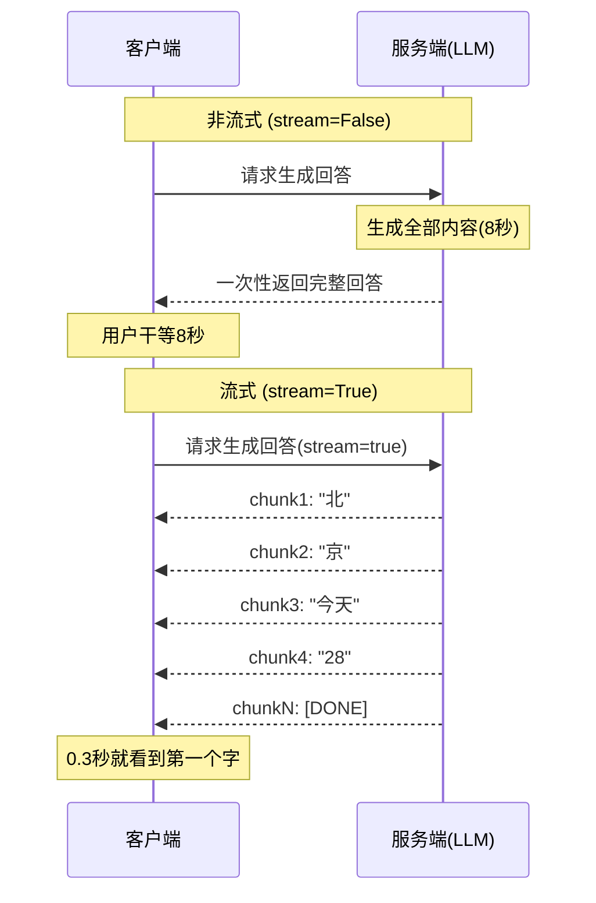
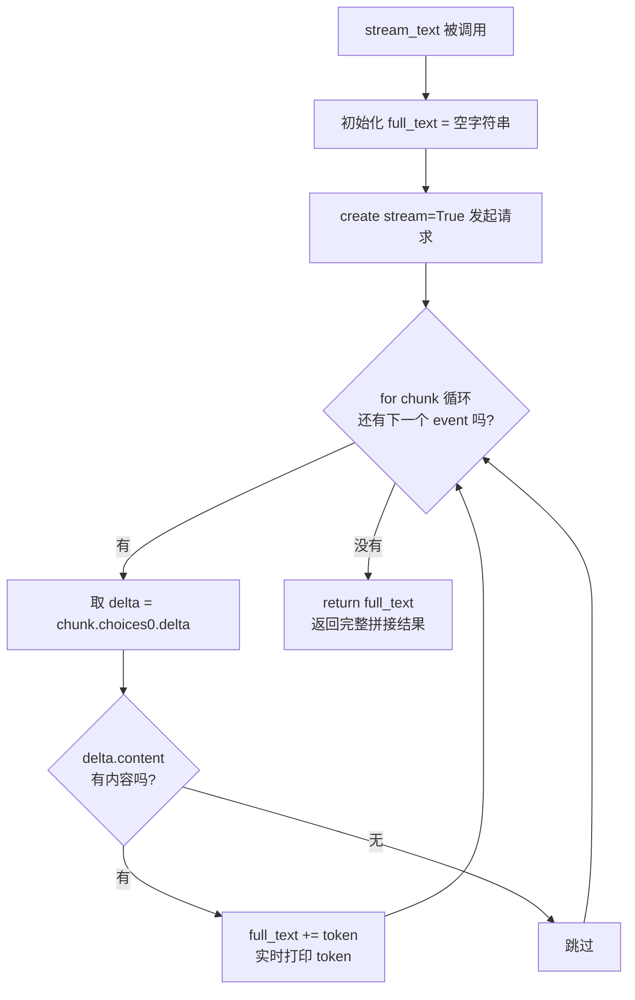
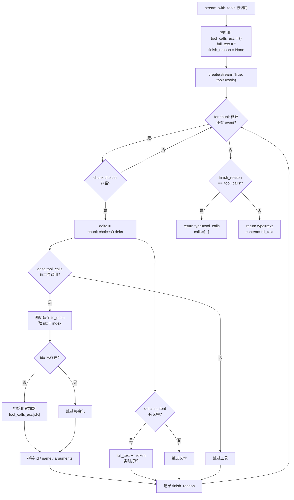
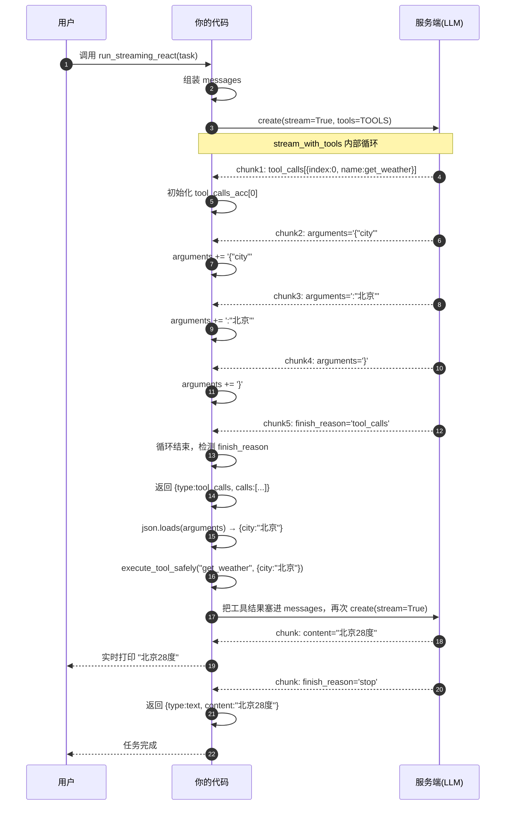

# Agent 开发第三阶段·专题：流式输出（Streaming）完全图解

> 学习目标：彻底搞懂流式输出的底层原理，能看懂并手写 `stream=True` 的完整处理逻辑，尤其理解"流式 + Function Calling"并存时的拼接难点。
>
> 对应代码：`agent_v3.py` 的 `StreamingLLM` 类（约第 324~500 行）

---

## 一、先建立直觉：非流式 vs 流式

想象你在等一封长信：

**非流式（stream=False）**：对方把整封信写完，才一次性寄给你。

```python
# 请求发出后，你在屏幕前干等 8 秒
client.chat.completions.create(stream=False)
# ... 8秒后 ...
response.choices[0].message.content
# → "北京今天28度晴，适合出行"  (一次性拿到全文)
```

**流式（stream=True）**：对方写一个字，就寄给你一个字。

```python
# 请求发出后 0.3 秒，第一个字就来了
client.chat.completions.create(stream=True)
# 边生成边收到："北" → "京" → "今天" → "28" → "度" → ...
```

### 1.1 时序图对比



### 1.2 核心目的

| 维度 | 非流式 | 流式 |
|------|--------|------|
| 返回方式 | 生成完才返回 | 生成一个 token 推一个 |
| 首字延迟 | 高（等全部生成完） | 低（第一个 token 立刻到） |
| 用户体验 | 盯着空白屏幕等 | 文字逐字蹦出来 |
| 代码复杂度 | 简单（SDK 帮你拼好） | 高（自己拼接碎片） |

**一句话**：流式的本质是**降低"首字延迟"，让用户感知更快**。代价是把"拼接完整回答"的责任从 SDK 转移到了你身上。

---

## 二、三个核心概念：chunk / delta / event

| 概念 | 含义 | 位置 |
|------|------|------|
| **event（事件）** | SSE 协议里服务端推送的最小单元，一行 `data: {...}` | 传输层 |
| **chunk（块）** | 代码里 `for chunk in stream` 每次迭代拿到的东西 | 代码层 |
| **delta（增量）** | chunk 里真正携带新内容的字段 | 数据层 |

```
SSE 传输层:   data: {...}    data: {...}    data: {...}    data: [DONE]
                    │              │              │              │
代码层:        ┌─────▼──┐      ┌────▼──┐      ┌───▼───┐
              │ chunk1 │      │chunk2 │      │chunk3 │  ...  循环结束
              └─────┬──┘      └────┬──┘      └───┬───┘
                    │              │              │
数据层:        delta.content  delta.tool_calls  delta.content ...
```

**一句话总结**：`一个 chunk = 一个 event 的数据 = 一次服务端推送`。里面可能含一点文字（`delta.content`）或一点工具调用信息（`delta.tool_calls`）。

### 2.1 一个 chunk 的真实结构

```json
{
  "choices": [
    {
      "index": 0,
      "delta": {
        "content": "北",          // 增量文本（可能为 null）
        // 或 "tool_calls": [...]  // 增量工具调用（可能为 null）
      },
      "finish_reason": null       // 流结束原因，只有最后一个 chunk 才非 null
    }
  ]
}
```

---

## 三、真实数据：一次流式调用到底收到什么

假设任务是 `"查北京天气"`，LLM 决定调用工具 `get_weather(city="北京")`。服务端实际推送的 chunk 序列如下：

### chunk 1（第一个事件）

此时 `delta.content` 是 `null`，但 `delta.tool_calls` 出现了，带出工具名：

```json
{ "choices": [{ "delta": {
    "tool_calls": [
      { "index": 0, "id": "call_abc123",
        "function": { "name": "get_weather", "arguments": "" } }
    ]
  }, "finish_reason": null }] }
```

### chunk 2

arguments 开始分批到达，这次只来了 `{"city`：

```json
{ "choices": [{ "delta": {
    "tool_calls": [
      { "index": 0,
        "function": { "arguments": "{\"city\"" } }
    ]
  }, "finish_reason": null }] }
```

### chunk 3

```json
{ "choices": [{ "delta": {
    "tool_calls": [
      { "index": 0,
        "function": { "arguments": ":\"北京\"" } }
    ]
  }, "finish_reason": null }] }
```

### chunk 4

```json
{ "choices": [{ "delta": {
    "tool_calls": [
      { "index": 0,
        "function": { "arguments": "}" } }
    ]
  }, "finish_reason": null }] }
```

### chunk 5（最后一个事件）

没有 delta 内容了，`finish_reason` 变成 `"tool_calls"`，表示流结束：

```json
{ "choices": [{ "delta": {}, "finish_reason": "tool_calls" }] }
```

> 💡 **看懂了吗？** 工具参数 `{"city":"北京"}` 被拆成了 3 个 chunk（`{"city"` → `:"北京"` → `}`），所以你的代码必须**把它们拼起来**。这就是流式 + Function Calling 的核心难点。

---

## 四、方法1：stream_text（纯文本场景）

这是最简单的情况，用于 Planner 输出计划、Reviewer 输出总结等**不需要工具**的场景。

### 4.1 完整代码逐行讲解

```python
@staticmethod
def stream_text(messages, model, on_token=None):
    full_text = ""                        # ① 准备一个空桶，装拼接结果

    stream = client.chat.completions.create(
        model=model, messages=messages,
        stream=True,                      # ② 核心开关：开启流式
    )

    for chunk in stream:                  # ③ 每次迭代 = 收到一个 event
        if chunk.choices and chunk.choices[0].delta:
            delta = chunk.choices[0].delta # ④ 取出增量数据
            if delta.content:              # ⑤ 有文字才处理
                token = delta.content      # ⑥ 拿到这一小片文字
                full_text += token         # ⑦ 拼进桶里
                if on_token:
                    on_token(token)        # ⑧ 回调（自定义处理）
                else:
                    print(token, end="", flush=True)  # ⑨ 实时打印

    return full_text                       # ⑩ 返回完整拼接结果
```

### 4.2 真实数据走一遍

假设 LLM 回答 `"北京今天28度晴"`，循环执行过程：

| 循环次数 | delta.content | full_text 变成 | 屏幕显示 |
|---------|--------------|---------------|---------|
| 第1次 | `北京` | "北京" | 北京 |
| 第2次 | `今天` | "北京今天" | 北京今天 |
| 第3次 | `28` | "北京今天28" | 北京今天28 |
| 第4次 | `度` | "北京今天28度" | 北京今天28度 |
| 第5次 | `晴` | "北京今天28度晴" | 北京今天28度晴 |
| 第6次 | `(null)` | 不变 | 不变（流结束） |

### 4.3 流程图



---

## 五、方法2：stream_with_tools（Function Calling 场景）★重点★

这是最复杂、分支最多的方法。它要同时处理**文字**和**工具调用**两种增量。

### 5.1 完整代码逐行讲解

```python
@staticmethod
def stream_with_tools(messages, tools, model, on_text=None):

    # ── ① 三个关键变量 ──
    tool_calls_acc = {}   # 工具调用累加器，结构 {index: {id, function:{name, arguments}}}
    full_text = ""        # 文本累加器（和 stream_text 一样）
    finish_reason = None  # 记录流结束原因

    stream = client.chat.completions.create(
        model=model, messages=messages, tools=tools,
        stream=True,
    )

    for chunk in stream:
        if not chunk.choices:
            continue               # ② 防御：空 choices 直接跳过

        delta = chunk.choices[0].delta

        # ── ③ 分支A：处理纯文本 ──
        if delta.content:
            token = delta.content
            full_text += token
            if on_text: on_text(token)
            else: print(token, end="", flush=True)

        # ── ④ 分支B：处理工具调用 ──
        if delta.tool_calls:
            for tc_delta in delta.tool_calls:
                idx = tc_delta.index     # 工具序号(0,1,2...)，LLM可一次调多个工具

                # ⑤ 第一次见到这个 index，先初始化累加器
                if idx not in tool_calls_acc:
                    tool_calls_acc[idx] = {
                        "id": "",
                        "function": {"name": "", "arguments": ""},
                    }

                # ⑥ id 通常只在第一个 chunk 出现
                if tc_delta.id:
                    tool_calls_acc[idx]["id"] = tc_delta.id

                # ⑦ 工具名通常只在第一个 chunk 出现
                if tc_delta.function and tc_delta.function.name:
                    tool_calls_acc[idx]["function"]["name"] = tc_delta.function.name

                # ⑧ 参数是 JSON 字符串，分散在多个 chunk，逐段拼接 ★核心★
                if tc_delta.function and tc_delta.function.arguments:
                    tool_calls_acc[idx]["function"]["arguments"] += tc_delta.function.arguments

        # ── ⑨ 记录 finish_reason（只有最后 chunk 才有值）──
        if chunk.choices[0].finish_reason:
            finish_reason = chunk.choices[0].finish_reason

    # ── ⑩ 流结束，判断返回哪种类型 ──
    if finish_reason == "tool_calls" and tool_calls_acc:
        return {"type": "tool_calls", "calls": [...]}   # 要调工具
    else:
        return {"type": "text", "content": full_text}   # 纯文本
```

### 5.2 核心难点：tool_calls_acc 是怎么一步步拼出来的

回到第三章的真实数据，跟踪 `tool_calls_acc` 这个变量在每个 chunk 之后的变化：

| 处理完哪个chunk | id | name | arguments（拼接过程） |
|----------------|-----|------|----------------------|
| 初始 | (还没初始化) | — | — |
| chunk 1 | `call_abc123` | `get_weather` | `""` |
| chunk 2 | `call_abc123` | `get_weather` | `{"city` |
| chunk 3 | `call_abc123` | `get_weather` | `{"city":"北京` |
| chunk 4 | `call_abc123` | `get_weather` | `{"city":"北京"}` |

> 🎯 注意看 `arguments` 这一列，它靠 `+=` 运算符，把 3 个 chunk 的碎片 `"{"city""` + `":"北京""` + `"}"` 拼成了完整的 `'{"city":"北京"}'`。这就是 `tool_calls_acc[idx]["function"]["arguments"] += ...` 这行代码的意义。

### 5.3 最终返回值

循环结束后，`finish_reason == "tool_calls"`，走 ⑩ 的第一个分支，返回：

```json
{
  "type": "tool_calls",
  "calls": [
    {
      "id": "call_abc123",
      "function": {
        "name": "get_weather",
        "arguments": "{\"city\":\"北京\"}"   // 已经拼完整的 JSON 字符串
      }
    }
  ]
}
```

### 5.4 完整流程图



---

## 六、两个方法什么时候用谁

| 场景 | 用哪个方法 | 为什么 |
|------|-----------|--------|
| Planner 输出计划 | `stream_text` | 纯文本，不需要 tools |
| Reviewer 最终回答 | `stream_text` | 纯文本总结 |
| Manager 最终汇总 | `stream_text` | 纯文本 |
| 流式 ReAct 循环 | `stream_with_tools` | 需要边想边调工具 |
| Worker 执行子任务 | `stream_with_tools` | 需要 Function Calling |

---

## 七、容易踩的坑

### 坑1：忘记拼接 arguments

如果只取第一个 chunk 的 arguments，你会得到残缺的 `{"city`，导致 `json.loads` 失败。

```python
# ❌ 错误：只取第一个 chunk
arguments = delta.tool_calls[0].function.arguments  # 只得到 '{"city'

# ✅ 正确：用 += 逐段拼接
tool_calls_acc[idx]["function"]["arguments"] += tc_delta.function.arguments
```

### 坑2：忘记处理 finish_reason

不判断 `finish_reason` 就无法知道流里到底有没有工具调用，也就无法区分"返回文本"还是"返回工具调用"。

```python
# ❌ 错误：不看 finish_reason，直接返回 text
return {"type": "text", "content": full_text}

# ✅ 正确：根据 finish_reason 判断
if finish_reason == "tool_calls":
    return {"type": "tool_calls", "calls": [...]}
return {"type": "text", "content": full_text}
```

### 坑3：多工具调用时 index 混淆

LLM 一次可能返回多个 tool_call（index=0,1,2），必须用 `index` 区分，否则两个工具的参数会混在一起。

```python
# 用 index 作为字典 key，区分不同工具
tool_calls_acc[idx] = {...}
```

### 坑4：空 chunk 没做防御

某些情况下服务端会推一个 `choices` 为空的 chunk（比如心跳），不做防御会报错。

```python
# ✅ 防御式处理
if not chunk.choices:
    continue
```

### 坑5：name / id 用 `=` 直接赋值，有潜在隐患 ⚠️

当前代码里，`name` 和 `id` 用的是 `=` 直接赋值，而 `arguments` 用的是 `+=` 拼接：

```python
# 当前写法（有隐患）
if tc_delta.id:
    tool_calls_acc[idx]["id"] = tc_delta.id                      # ❌ 用 =
if tc_delta.function and tc_delta.function.name:
    tool_calls_acc[idx]["function"]["name"] = tc_delta.function.name  # ❌ 用 =
if tc_delta.function and tc_delta.function.arguments:
    tool_calls_acc[idx]["function"]["arguments"] += tc_delta.function.arguments  # ✅ 用 +=
```

**为什么 `arguments` 要 `+=` 而 `name` 用 `=` ？**

因为 `arguments`（JSON 参数）可能很长，会跨多个 token，被服务端拆成几段推来，所以必须拼接。而 `name`（函数名）很短，通常一个 token 就完整了，OpenAI 协议约定它在第一个 chunk 一次性给完整。

**但这个"通常"靠不住，有两个风险：**

1. **OpenAI 官方 SDK 实际上对 name 也是用 `+=` 累加**，而不是 `=`。官方都不敢假设 name 一定一次性完整：

```python
# OpenAI 官方 SDK 内部的累加逻辑（简化）
self.name += tool_call.function.name or ""
self.arguments += tool_call.function.arguments or ""
```

2. **国产模型"兼容 OpenAI 协议"但细节可能不一致**。你用的是 DeepSeek，它声明兼容 OpenAI 协议，但流式内部实现不一定 100% 照搬。某些服务端实现里，name 也可能被拆：

```
chunk1: name = "get_wea"       ← 万一拆了
chunk2: name = "ther"          ← 用 = 会覆盖，前面丢了！
```

如果发生这种情况，`=` 写法会得到残缺的 `"ther"`，导致工具名错误。

**通用原则：**

> 流式数据里，凡是可能跨多个 chunk 的字段，一律用 `+=` 累加；只有 100% 确定"只出现一次且完整"的字段，才敢用 `=`。但你很难 100% 确定服务端行为，所以最稳妥的做法是**所有增量字段统一用 `+=`**，反正初始值是空字符串，累加不会出错。

**更健壮的写法（name 和 id 也改成 `+=`）：**

```python
# ✅ 健壮写法：所有字段统一用 += 累加
if tc_delta.id:
    tool_calls_acc[idx]["id"] += tc_delta.id
if tc_delta.function and tc_delta.function.name:
    tool_calls_acc[idx]["function"]["name"] += tc_delta.function.name
if tc_delta.function and tc_delta.function.arguments:
    tool_calls_acc[idx]["function"]["arguments"] += tc_delta.function.arguments
```

这样无论 name/id 是一次性完整、还是被拆成几段，都能正确拼起来，天然兼容各种服务端实现。

> 💡 注：当前 `agent_v3.py` 代码暂未改（仍用 `=`），这里作为知识点记录，后续动手改代码时注意即可。

---

## 八、完整时序图（含代码对应关系）



---

## 九、流式在 Agent 主循环中的位置

流式不是独立模式，而是"输出方式"的增强。它嵌在 ReAct 循环的每一次 LLM 调用里：

```python
def run_streaming_react(task, model):
    messages = [{"role": "system", "content": "..."},
                {"role": "user", "content": task}]

    step = 0
    while step < MAX_STEPS:
        step += 1

        # ★ 流式调用（支持 Function Calling）
        result = StreamingLLM.stream_with_tools(messages, TOOLS, model)

        if result["type"] == "tool_calls":
            # LLM 要调工具 → 执行 → 塞回历史 → 继续循环
            ...
            continue
        else:
            # LLM 不调工具了 → 返回最终文本
            return result["content"]
```

**关键**：流式让 ReAct 循环的每一轮都"实时可见"——LLM 的思考和工具调用过程不再是黑盒，用户能亲眼看到 Agent 在做什么。

---

## 十、核心认知总结

### 10.1 三个本质

```
流式 = 把"一次性返回"改成"碎片化推送"
  → 本质是降低首字延迟，代价是自己拼接

chunk = 服务端一次推送的最小数据单元
  → 一个 chunk 可能含文字，也可能含工具调用碎片

拼接 = 流式 + Function Calling 的核心难点
  → 因为工具参数(JSON)被拆散在多个 chunk，必须用 += 拼回完整
```

### 10.2 与非流式的本质区别

| | 非流式 | 流式 |
|--|--------|------|
| SDK 是否帮你拼 | ✅ 拼好再返回 | ❌ 不拼，碎片交给你 |
| 你能拿到什么 | 完整 message 对象 | 一堆 delta 增量 |
| 什么时候能处理 | 全部生成完 | 边生成边处理 |
| 适用场景 | 内部调用（规划/反思） | 用户可见的回答 |

### 10.3 一句话记住

> **非流式是"SDK 帮你拼好"，流式是"你自己拼，但能边收边处理"。** 理解了"自己拼"这三个字，就理解了流式输出的全部复杂度。

---

## 附录：流式输出术语速查

| 术语 | 含义 |
|------|------|
| SSE | Server-Sent Events，服务端向客户端推送事件的技术 |
| chunk | 流式传输中服务端一次推送的数据块 |
| delta | chunk 中携带增量内容的字段 |
| token | 模型输出的最小单位（1个字/几个字符/1个单词）|
| finish_reason | 流结束原因：`stop`(完成) / `tool_calls`(要调工具) |
| tool_calls_acc | 工具调用累加器，用于拼接分散的 tool_calls 数据 |
| 首字延迟 | 从发起请求到第一个字返回的时间 |
| 指数退避 | 重试时等待时间指数增长，避免压垮服务端 |
