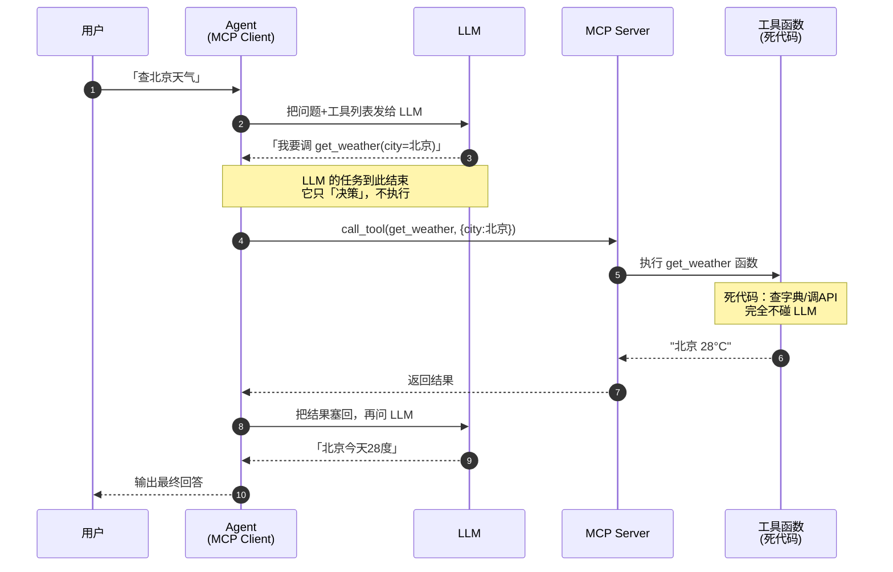
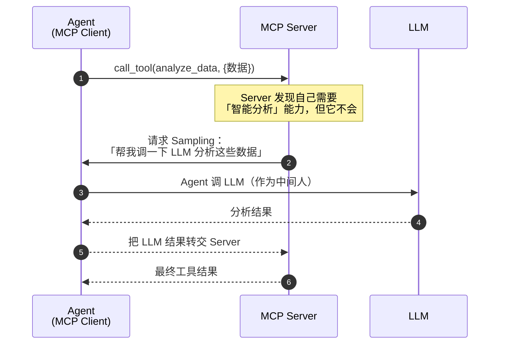

# Agent 开发第四阶段学习笔记：长期记忆 + 工具并行 + Human-in-the-loop + MCP

> 学习目标：掌握 2026 年生产级 Agent 的四个进阶能力——跨会话记忆、并行提速、人工把关、标准化工具协议。
>
> 对应代码：`agent_v4.py`（主循环）+ `v4_memory.py`（长期记忆）+ `v4_mcp_server.py`（MCP服务器）

---

## 一、全景总览：四个特性解决什么问题

### 1.1 一张图看懂 V4

```
┌───────────────────────────────────────────────────────────────┐
│                        Agent V4                                │
│                                                               │
│   ┌─────────────────────────────────────────────────────┐     │
│   │  会话开始                                            │     │
│   │    ① recall 长期记忆 → 注入 system prompt           │     │
│   │       「用户叫小明，喜欢喝咖啡」 → 让 LLM 记住用户    │     │
│   └─────────────────────────────────────────────────────┘     │
│                          ↓                                    │
│   ┌─────────────────────────────────────────────────────┐     │
│   │  主循环 while step < max_steps                       │     │
│   │    ② 调 LLM（工具 = 本地工具 + MCP工具）             │     │
│   │    ③ LLM 返回多个工具调用？                         │     │
│   │       └→ ④ 并行执行（无依赖，同时跑）                │     │
│   │    ⑤ 危险工具先人工确认（HITL）                      │     │
│   │    ⑥ 结果塞回 messages                              │     │
│   └─────────────────────────────────────────────────────┘     │
│                          ↓                                    │
│   ┌─────────────────────────────────────────────────────┐     │
│   │  会话结束                                            │     │
│   │    ⑦ 提取重要信息 → remember 写回长期记忆            │     │
│   │       「记住：用户叫小明」 → 下次会话能回忆           │     │
│   └─────────────────────────────────────────────────────┘     │
└───────────────────────────────────────────────────────────────┘
```

### 1.2 四个特性解决什么问题

| 特性 | 解决的痛点 | 一句话理解 |
|------|-----------|-----------|
| 长期记忆 | LLM 无状态，每次对话都失忆 | 让 Agent「记得你」 |
| 工具并行 | 多个工具串行执行太慢 | 无依赖的工具「一起跑」 |
| Human-in-the-loop | 危险操作不能全自动 | 关键时刻「人来拍板」 |
| MCP 协议 | 工具写死在代码里，无法复用 | 工具「即插即用」 |

### 1.3 文件分布

```
agent_v4.py          → 主循环（整合四个特性）
v4_memory.py         → 长期记忆模块（独立，可单独运行）
v4_mcp_server.py     → MCP 服务器（独立进程）
```

---

## 二、长期记忆（Long-term Memory）

### 2.1 为什么需要长期记忆

LLM 本质上是**无状态**的——它不记得任何之前的对话。前三个阶段的 Agent 都是「金鱼记忆」，关掉程序就全忘了：

```
会话 A（周一）：用户说「我叫小明，在北京工作，喜欢喝咖啡」
     ↓ 关掉程序，重启
会话 B（周五）：用户问「我喜欢喝什么？」
     ↓
前三个阶段的 Agent：❌ 「我不知道」（因为完全失忆）
V4 的 Agent：        ✅ 「你喜欢喝咖啡」（因为记住了）
```

### 2.2 多层记忆架构（2026 工业标准）

```
┌─────────────────────────────────┐
│  短期记忆（工作记忆）             │
│  · 当前对话的 messages 列表       │
│  · 只存在于本次会话，结束就没了    │
│  · 上下文窗口有限，塞不下全部      │
├─────────────────────────────────┤
│  长期记忆                        │
│  · 持久化到磁盘，跨会话保存       │
│  · 记住重要信息，下次能回忆        │
│  · 通过检索（而非全量塞入）召回    │
└─────────────────────────────────┘
```

**关键区别**：
- 短期记忆 = 全部塞进上下文（成本高，但即时可用）
- 长期记忆 = 存到外部，需要时**检索召回**（成本低，但要多一步检索）

### 2.3 核心代码：LongTermMemory 类

```python
class LongTermMemory:
    """
    长期记忆：把重要信息持久化到磁盘，跨会话保存。

    数据结构（每条记忆）：
      {
        "id": "唯一标识",
        "content": "记忆内容，如「用户叫小明」",
        "timestamp": 记录时间戳,
        "importance": 重要度（1~5，越高越不容易遗忘）
      }
    """

    def __init__(self, file_path: str = "memory_store.json"):
        self.file_path = Path(file_path)
        self.entries = self._load()   # 从磁盘加载记忆

    def remember(self, content: str, importance: float = 1.0) -> str:
        """记住一条信息"""
        entry = {
            "id": uuid.uuid4().hex[:8],
            "content": content,
            "timestamp": time.time(),
            "importance": importance,
        }
        self.entries.append(entry)
        self._save()   # 写回磁盘（持久化）
        return entry["id"]

    def recall(self, query: str, top_k: int = 3) -> list:
        """回忆相关信息（TF-IDF + 余弦相似度检索）"""
        # 和 RAG 检索逻辑一样：查询向量化 → 算相似度 → 排序取top_k
        ...

    def forget(self, entry_id: str) -> bool:
        """遗忘一条记忆（隐私合规 / 清理过时信息）"""
        ...
```

### 2.4 记忆的三个操作：记 / 忆 / 忘

| 操作 | 方法 | 触发时机 | 类比 |
|------|------|---------|------|
| 记（remember）| 写入新记忆 | 会话结束提取重要信息 | 把重要的事记进笔记本 |
| 忆（recall）| 检索相关记忆 | 会话开始注入 prompt | 翻开笔记本找相关内容 |
| 忘（forget）| 删除记忆 | 用户要求 / 信息过时 | 划掉笔记本里的旧记录 |

### 2.5 记忆管理的核心智慧：存精华，不存全部

会话结束时，**不是无脑全部记住**，而是让 LLM 提取「值得长期记住的稳定事实」：

```python
def _save_memory(memory, task, answer, model):
    """会话结束，让 LLM 提取值得记住的信息"""
    extract_prompt = """
从对话中提取值得长期记住的「用户个人信息或偏好」。
规则：
1. 只提取关于用户的稳定事实（姓名、职业、偏好、在做的事）
2. 不要提取一次性信息（当天的天气、临时计算）
3. 没有就回复「无」
"""
    response = client.chat.completions.create(
        model=model,
        messages=[{"role": "user", "content": extract_prompt}],
    )
    # 逐行提取，写入长期记忆
    ...
```

**为什么？** 对话里大量是废话（寒暄、中间过程），全记住会污染记忆库，导致检索不精准。

### 2.6 与 RAG 的关系（重要区分）

| | RAG（v2/v3） | 长期记忆（v4） |
|--|-------------|---------------|
| 存储内容 | 只读的外部知识（产品FAQ、文档） | 可读写的用户记忆（偏好、事实） |
| 谁写入 | 开发者提前准备 | Agent 运行时动态写入 |
| 典型问题 | "产品定价多少？" | "我喜欢喝什么？" |
| 本质 | 回答「知识」 | 回答「关于你的知识」 |

**底层检索逻辑完全一样**（都是 TF-IDF/embedding + 余弦相似度），区别在于语义和读写方式。

### 2.7 生产环境 vs 教学版

| 环节 | 教学版（零依赖） | 生产环境 |
|------|----------------|---------|
| 存储 | JSON 文件 | 向量数据库（Qdrant/Milvus） |
| 检索 | TF-IDF | embedding 模型 |
| 淘汰 | 手动 forget | 自动淘汰（时间衰减 + 重要度评分） |
| 摘要 | 手动 | 自动压缩（超阈值触发） |

---

## 三、工具并行（Parallel Tools）

### 3.1 为什么需要并行

Agent 常常一次要查多个独立的信息，串行执行会慢：

```
场景：用户问「查北京、上海、深圳、广州四个城市的天气」

串行（一个接一个）：
  get_weather(北京) → 等1秒 → get_weather(上海) → 等1秒 → ...
  总耗时 = 4 × 1秒 = 4秒

并行（同时进行）：
  4个 get_weather 同时发出
  总耗时 ≈ 1秒（取最慢的那个）
```

### 3.2 什么时候能并行

**关键判断：多个工具之间有没有依赖？**

```
✅ 可并行（无依赖）：
  get_weather(北京) + get_weather(上海) + calculate(3*4)
  三个操作互不依赖，可以同时做

❌ 不能并行（有依赖）：
  第一步 get_user_id(小明) → 得到 id=123
  第二步 get_orders(id=123)   ← 依赖第一步的结果
  必须先做第一步，再做第二步
```

**实践中的简化**：LLM 在同一次响应里返回的多个 tool_calls，通常是无依赖的（有依赖时 LLM 会分多轮返回）。所以可以简单地把「同一批 tool_calls」都并行执行。

### 3.3 核心代码：ThreadPoolExecutor 并行

```python
from concurrent.futures import ThreadPoolExecutor, as_completed

def _execute_tool_calls(tool_calls, mcp_client):
    results = []

    if PARALLEL_TOOLS and len(tool_calls) > 1:
        # ── 并行执行 ──
        # ThreadPoolExecutor：线程池，让多个任务同时跑
        with ThreadPoolExecutor(max_workers=len(tool_calls)) as executor:
            # 提交所有任务，拿到 future（还没执行完的结果）
            futures = {}
            for tc in tool_calls:
                name = tc.function.name
                args = json.loads(tc.function.arguments)
                future = executor.submit(_execute_single, name, args, mcp_client)
                futures[future] = tc

            # as_completed：哪个任务先完成就先返回哪个
            for future in as_completed(futures):
                tc = futures[future]
                result = future.result()
                results.append({"name": tc.function.name, "result": result, "id": tc.id})
    else:
        # ── 串行执行 ──
        for tc in tool_calls:
            ...
    return results
```

### 3.4 并行 vs 串行对比

| 维度 | 串行 | 并行 |
|------|------|------|
| 执行方式 | 一个接一个 | 同时进行 |
| 总耗时 | N × 单次耗时 | ≈ 单次耗时 |
| 实现 | 简单 for 循环 | ThreadPoolExecutor |
| 适用 | 有依赖的工具 | 无依赖的工具 |
| 结果顺序 | 固定 | 乱序（谁先完成谁先返回）|

### 3.5 真实运行对比

```
串行执行 3 个工具:
  🔧 调用 get_weather(北京) → 28°C
  🔧 调用 get_weather(上海) → 26°C
  🔧 调用 get_weather(深圳) → 32°C
  （一个接一个，顺序固定）

并行执行 3 个工具:
  ⚡ 并行执行 3 个工具...
  ✅ get_weather → 26°C，多云   ← 顺序乱了（上海先完成）
  ✅ get_weather → 28°C，晴
  ✅ get_weather → 32°C，雷阵雨
  （同时进行，谁先完成先返回）
```

> 💡 注意：并行时结果顺序是乱的（`as_completed` 按完成顺序返回）。如果你的逻辑依赖顺序，要注意处理。

---

## 四、Human-in-the-loop（HITL）

### 4.1 为什么需要人工介入

有些操作是**不可逆**或**高风险**的，不能让 Agent 全自动执行：

```
危险操作示例：
  - 发送邮件（发错了收不回来）
  - 删除文件/数据（删了就没了）
  - 银行转账/扣款（钱转出去难追回）
  - 发布上线（发布出去影响所有用户）

这些操作，Agent 应该在执行前暂停，等人类拍板。
```

### 4.2 HITL 的核心思想

```
全自动模式：
  LLM 决策 → 执行 → 结果        （人完全不参与）

Human-in-the-loop 模式：
  LLM 决策 → 🛑 暂停 → 人确认 → 执行 → 结果
                    ↑
              人在这里把关
```

### 4.3 核心代码：执行前暂停确认

```python
# 需要人工确认的工具集合
APPROVAL_REQUIRED_TOOLS = {"send_email"}

def _execute_single(name, args, mcp_client):
    # ── HITL 人工确认 ──
    if ENABLE_HITL and name in APPROVAL_REQUIRED_TOOLS:
        print(f"🛑 即将执行【{name}】，这是不可逆操作")
        print(f"   参数: {args}")
        answer = input("   确认执行吗？输入 y 继续，其他任意键取消: ")
        if answer != "y":
            return "❌ 用户取消了该操作"
        print("   ✅ 用户已确认")

    # ── 执行 ──
    ...
```

### 4.4 运行效果

```
🛑 即将执行【send_email】，这是不可逆操作
   参数: {'to': '张三', 'subject': '项目进展', 'body': '明天下午3点开会'}
   确认执行吗？输入 y 继续，其他任意键取消: y
   ✅ 用户已确认
   ✅ 邮件已发送给 张三
```

如果用户输入 `n` 或直接回车，操作会被取消，返回「用户取消了该操作」。

### 4.5 哪些操作需要 HITL

| 类型 | 是否需要 HITL | 例子 |
|------|-------------|------|
| 只读查询 | ❌ 不需要 | 查天气、查资料 |
| 计算 | ❌ 不需要 | 算数学 |
| 可逆修改 | 视情况 | 改备注（低风险） |
| 不可逆操作 | ✅ 必须 | 发邮件、删数据、转账 |
| 影响面大 | ✅ 必须 | 上线发布、群发消息 |

**判断标准**：操作能否回滚？影响范围多大？成本多高？

### 4.6 谁来决定暂停？—— 设计哲学（重要）

一个核心疑问：**哪些操作要暂停，是 LLM 决定的，还是代码写死的？**

答案是：**代码写死的**。当前实现用一个硬编码集合来标记：

```python
# 需要人工确认的工具集合（HITL）
APPROVAL_REQUIRED_TOOLS = {"send_email"}

def _execute_single(name, args, mcp_client):
    if ENABLE_HITL and name in APPROVAL_REQUIRED_TOOLS:   # ← 代码判断
        answer = input("确认执行吗？")
        if answer != "y":
            return "❌ 用户取消了该操作"
```

```
工具名 ∈ APPROVAL_REQUIRED_TOOLS ?
  ├─ 是 → 暂停，等人输入 y/n
  └─ 否 → 直接执行，不暂停
```

**这个判断完全由代码完成，LLM 不参与。**

#### 为什么不用 LLM 判断？

这是设计上的关键权衡：

| 方案 | 谁来判断 | 优点 | 缺点 |
|------|---------|------|------|
| **代码白名单**（当前） | 开发者写死集合 | ✅ 100% 可控、可靠、可审计 | 加新工具要改代码 |
| **LLM 动态判断** | 让 LLM 判断是否危险 | 灵活，不用改代码 | ❌ 不可靠，可能漏判 |

**为什么不能让 LLM 判断？** 因为 HITL 的目的是"安全兜底"，而安全兜底**必须可靠**。LLM 会：
- 偶尔"忘记"某个操作很危险 → 漏判 → 危险操作被执行
- 判断不稳定 → 同一个操作这次暂停下次不暂停

**安全相关的东西，容不得模型"偶尔判断失误"。**

> 类比：银行的转账风控规则，不会让 AI 现场决定"这笔要不要人工审核"，而是写死在系统里的确定性规则。

#### 一句话总结

```
LLM 负责：决定「调用 send_email 这个工具」   ← 规划层，可以灵活
代码负责：决定「send_email 需不需要确认」    ← 安全层，必须写死
```

**规划交给 LLM（因为它聪明），安全交给代码（因为它可靠）。**

### 4.7 成熟的 HITL 决策方案（进阶）

如果你觉得"所有都写死在代码里比较麻烦"，2026 年工业界的成熟方案**不是"让 LLM 决定"，而是"把规则做得更灵活、可配置"**。四种方案：

#### 方案一：工具注解（Tool Annotations）—— 推荐入门

让**工具自己声明**"我危不危险"，而不是 Agent 开发者写死。这是 MCP 协议自带的特性：

```python
from mcp.types import Tool, ToolAnnotations

delete_tool = Tool(
    name="delete_file",
    description="删除文件",
    inputSchema={...},
    annotations=ToolAnnotations(
        readOnlyHint=False,      # 不是只读
        destructiveHint=True,    # 是破坏性操作 ← 关键
        openWorldHint=False,
    ),
)
```

```python
# 执行时，代码读工具自带的 destructiveHint 自动判断，不用手动维护白名单
if tool.annotations.destructiveHint:
    暂停确认()
```

**好处**：工具提供者（可能是另一个团队/第三方）自己声明风险，Agent 开发者不用维护白名单。工具热插拔时，风险信息跟着工具走。

#### 方案二：策略引擎（Policy Engine / OPA）—— 生产级标准

用**声明式策略文件**（而非 Python 代码）定义"哪些要暂停"，策略和代码分离：

```rego
# policy.rego —— 策略文件（Rego 语言）
package agent.hitl

default allow = true
allow = false { input.tool_name == "delete_file" }
allow = false { input.tool_name == "transfer_money" }
allow = false { startswith(input.tool_name, "publish_") }
```

```python
# Python 只做一件事：把工具调用丢给策略引擎裁决
result = opa.evaluate("agent.hitl", {"tool_name": name})
if not result["allow"]:
    暂停确认()
```

**好处**：改策略不用改代码、不用重启（热加载）；策略可集中管理、审计、版本控制；安全团队可独立维护策略。

#### 方案三：LLM 分诊 + 确定性闸门（折中，部分用 LLM）

最接近"想让 LLM 参与"的方案，但 **LLM 只提建议，不做最终决定**：

```
工具调用进来
    ↓
① LLM 打分：这个操作风险有多高？（1~5分）
    ↓
② 代码用确定性阈值判断：
    分数 >= 4  → 必须人工确认
    分数 < 4   → 自动执行
```

LLM 负责"智能地识别风险"（灵活、能理解语义），代码负责"拍板"（可靠）。代价是多一次 LLM 调用。

#### 方案四：Human-on-the-loop（监督式）

区分两个概念：

| 模式 | 人怎么参与 | 适合场景 |
|------|-----------|---------|
| Human-**in**-the-loop | 每次关键操作都暂停等人 | 发邮件、转账 |
| Human-**on**-the-loop | 系统自主运行，人**监控**，异常才介入 | 大规模自动化 |

HOTL 的思路：不让每个操作都打断人，而是系统记录所有高风险操作，**事后审计 + 异常报警**。人从"每个都要批"变成"盯监控大盘"。

#### 方案对比总结

| 方案 | LLM 参与度 | 可靠性 | 维护成本 | 适合 |
|------|-----------|--------|---------|------|
| 代码硬编码（v4 现状）| 无 | ★★★★★ | 高（改代码） | 学习/小项目 |
| 工具注解 | 无 | ★★★★★ | 低（工具自声明） | 推荐升级方向 |
| 策略引擎 OPA | 无 | ★★★★★ | 低（改配置文件） | 生产级 |
| LLM 分诊+闸门 | 部分（打分）| ★★★★ | 中 | 复杂多变场景 |
| 纯 LLM 决定 | 完全 | ★★ | — | ❌ 不推荐 |

> **核心结论**：让 LLM **完全自主决定**是否暂停——没有可靠方案，也不推荐。但"写死麻烦"有成熟解法——把规则从"Python 硬编码"升级成"**工具注解**"或"**策略引擎**"（声明式、可配置、热更新），既解决维护麻烦，又保住可靠性。

---

## 五、MCP 协议（Model Context Protocol）

### 5.1 MCP 是什么

MCP（Model Context Protocol，模型上下文协议）是 Anthropic 提出、2026 年已成为行业事实标准的**工具标准化协议**。

它解决的核心痛点：

```
传统 Function Calling：
  每个 Agent 都要自己写工具调用代码
  工具写死在 Agent 里，换个 Agent 就要重写
  → 工具无法复用，重复造轮子

MCP：
  工具由「独立的 MCP Server」提供
  任何 Agent 通过「MCP Client」动态发现并调用
  → 一次编写，处处复用，热插拔
```

### 5.2 类比理解

```
传统 Function Calling ≈ 每家餐馆自己雇厨师
  （每个 Agent 自己写工具）

MCP ≈ 统一的外卖平台
  （商家上架菜品 = MCP Server 提供工具）
  （任何 App 都能点 = 任何 Agent 都能调用）
```

### 5.3 MCP 四层架构

```
┌─────────────────────────────────┐
│ 应用层：Client / Server / Agent   │
├─────────────────────────────────┤
│ 协议层：Tools / Resources /       │
│          Prompts / Sampling       │
├─────────────────────────────────┤
│ 消息层：JSON-RPC 2.0             │
├─────────────────────────────────┤
│ 传输层：stdio / HTTP+SSE / WS     │
└─────────────────────────────────┘
```

### 5.4 四大核心抽象

| 抽象 | 作用 | 类比 |
|------|------|------|
| Tools | Agent 主动调用的操作 | 点外卖 |
| Resources | Agent 被动读取的数据 | 看菜单 |
| Prompts | 预定义的提示模板 | 套餐推荐 |
| Sampling | Server 反向请求 Client 调 LLM | 商家询问你的口味 |

### 5.5 MCP vs Function Calling 对比

| 特性 | 传统 Function Calling | MCP |
|------|---------------------|-----|
| 定义位置 | 硬编码在 Agent 代码中 | 独立 Server 动态提供 |
| 工具发现 | 静态列表 | 动态 list_tools + 热插拔 |
| 复用性 | 框架锁定 | 跨语言、跨框架通用 |
| 状态管理 | 无状态 | 支持会话级状态 |
| 多模态 | 弱 | 原生支持 |
| 工具更新 | 改代码重启 | 热插拔，0 停机 |

**效率量化（2026 实测）**：
- 单工具接入耗时：2 天 → 2 小时（-90%）
- 代码复用率：20% → 80%
- 工具更新停机：30分钟 → 0秒

### 5.6 核心代码：MCP 服务器（v4_mcp_server.py）

```python
from mcp.server.mcpserver import MCPServer

# 创建服务器实例
mcp = MCPServer("agent-tools")

# 用装饰器 @mcp.tool() 定义工具
@mcp.tool()
def get_weather(city: str) -> str:
    """查询指定城市的天气。"""
    return f"{city}: 28°C，晴"

@mcp.tool()
def calculate(expression: str) -> str:
    """安全计算数学表达式。"""
    return eval(expression)

# 启动（stdio 传输，作为子进程被客户端拉起）
if __name__ == "__main__":
    mcp.run(transport="stdio")
```

**关键点**：工具定义和 Agent 完全解耦。MCP Server 独立运行，Agent 通过协议调用。

### 5.7 核心代码：MCP 客户端（agent_v4.py 里）

```python
class MCPClient:
    """连接 MCP 服务器，动态发现并调用工具"""

    async def _async_connect(self):
        # stdio 传输：把服务器作为子进程启动
        params = StdioServerParameters(
            command=sys.executable,      # ★ 用当前解释器，保证环境一致
            args=["v4_mcp_server.py"],
        )
        async with stdio_client(params) as (read, write):
            async with ClientSession(read, write) as session:
                await session.initialize()
                # 动态发现工具（list_tools）
                tools = await session.list_tools()
                # 转成 OpenAI 格式
                for tool in tools.tools:
                    self.tools.append({
                        "type": "function",
                        "function": {
                            "name": tool.name,
                            "description": tool.description,
                            "parameters": tool.input_schema,  # mcp 2.x 用 snake_case
                        },
                    })
```

### 5.8 重要：mcp 2.x 的 API 变化（实战踩坑）

mcp 在 2026-07-28 发布了 2.x 大版本，API 有重大变化。这是学习时最容易踩的坑：

| 变化点 | mcp 1.x | mcp 2.x |
|--------|---------|---------|
| 服务器类名 | `FastMCP` | `MCPServer` |
| 导入路径 | `mcp.server.fastmcp` | `mcp.server.mcpserver` |
| 传输参数位置 | 构造函数 | `run()` 方法 |
| 字段命名 | camelCase（`inputSchema`） | snake_case（`input_schema`） |
| 错误类 | `McpError` | `MCPError` |

```python
# mcp 1.x（旧）
from mcp.server.fastmcp import FastMCP
mcp = FastMCP("demo")
mcp.run(transport="stdio")
# 客户端：tool.inputSchema

# mcp 2.x（新，2026年7月后）
from mcp.server.mcpserver import MCPServer
mcp = MCPServer("demo")
mcp.run(transport="stdio")
# 客户端：tool.input_schema
```

**教训**：安装依赖时要注意大版本。如果网上的教程用的是 `FastMCP`，那可能是基于 mcp 1.x 的旧教程，实际安装时会装到 2.x，导致报错。

### 5.9 MCP 的三种传输方式

| 传输方式 | 适用场景 | 优点 | 缺点 |
|---------|---------|------|------|
| stdio | 本地进程 | 零网络配置 | 单机限制 |
| HTTP+SSE | 远程工具 | 分布式、易扩展 | 需网络配置 |
| WebSocket | 实时双向 | 全双工 | 实现复杂 |

本教程用 stdio（最简单，适合本地学习）。生产环境远程工具用 HTTP+SSE。

### 5.10 MCP 到底调用 LLM 吗？—— 本质澄清（重要）

一个最容易困惑的点。先直接回答三个疑问：

| 疑问 | 答案 |
|------|------|
| 所有工具都用 MCP？ | ❌ 不是。MCP 是**可选的**，可以本地工具 + MCP 工具混用 |
| MCP 会调用 LLM 吗？ | ❌ **不会**（正常情况）。MCP 只负责"连接"，不碰 LLM |
| MCP 里是死代码工具集？ | ✅ **对**。MCP Server 里就是普通函数，跑死代码/调 API |

#### 核心认知一句话

> MCP 是「**连接协议**」，不是「执行引擎」。它解决的是"Agent 怎么发现和调用工具"，而不是"工具怎么干活"。MCP Server 里装的是和 `agent.py` 里一模一样的死代码函数，唯一区别是——它用标准协议暴露，能被任何 Agent 调用。

#### 四个角色的关系图

```
┌──────────┐         ┌───────────────┐          ┌──────────────┐
│   LLM    │  对话    │    Agent      │   MCP    │  MCP Server  │
│  (大脑)   │◄───────►│  (编排器)     │  协议    │  (工具集合)   │
│          │         │ = MCP Client  │◄────────►│              │
│ 决策调   │         │               │          │ 死代码函数    │
│ 哪个工具  │         │               │          │              │
└──────────┘         └───────────────┘          └──────┬───────┘
                                                       │
                                                  ┌────▼─────┐
                                                  │ 查数据库  │
                                                  │ 调外部API │
                                                  │ 算数学    │
                                                  └──────────┘
```

**关键点**：LLM 和 MCP Server 之间**没有直接连线**。它们通过 Agent（MCP Client）间接协作——LLM 不直接碰 MCP，MCP Server 也不碰 LLM。

#### 一句话记住

> **LLM 是大脑（决策），MCP Server 是手脚（执行死代码），Agent 是神经系统（连接两者）。MCP 就是"神经系统里标准化的那根神经"。**

### 5.11 MCP 完整时序图（正常调用）



**逐步拆解**：

1. **用户提问** → 交给 Agent
2. **Agent 问 LLM** → "这个问题怎么办？有哪些工具？"
3. **LLM 决策** → "调 get_weather，参数是北京"（LLM 只干到这里，是"大脑"，只动嘴不动手）
4. **Agent 通过 MCP 调 Server** → 把 LLM 的决定转达给工具
5. **Server 执行函数** → 死代码（查字典返回 mock 数据），**完全不碰 LLM**
6. **结果返回** → Server → Agent
7. **Agent 再问 LLM** → "工具返回了'28度'，怎么组织语言回答？"
8. **LLM 生成回答** → 最终输出

**看出来了吗？** MCP Server 只干第 4~6 步（执行死代码），LLM 只干第 2、3、7、8 步（思考和决策）。**两者各司其职，互不调用。**

### 5.12 Sampling：唯一的例外

严格说，MCP 有一个例外特性叫 **Sampling**——它允许 MCP Server **反向请求** Client 帮它调 LLM：



**理解要点**：
- 不是"MCP 直接调 LLM"，而是 **Server 请求 Client 帮忙调**，Client 才是真正调 LLM 的人
- 这相当于"MCP 工具内部也能借 LLM 的脑子"——让工具更智能
- 但这是**高级特性**，大多数 MCP 工具用不到，学习阶段可忽略

### 5.13 我到底用不用 MCP？

一个决策树帮你判断：

```
你的工具要不要被「多个不同 Agent / 团队 / 语言」复用？
│
├─ 不需要（就自己一个 Agent 用）
│   └─ 用本地工具（简单，像 v1/v2/v3）
│
├─ 需要（多个 Agent 共享、跨语言、第三方提供）
│   └─ 用 MCP（标准、可热插拔）
│
└─ 混合（本地常用 + MCP 共享）
    └─ 像 v4 一样，本地工具 + MCP 工具并存
```

**验证你的 v4 代码**：`v4_mcp_server.py` 里的工具全是死代码：

```python
@mcp.tool()
def get_weather(city: str) -> str:
    fake_weather = {"北京": "28°C，晴", ...}
    return fake_weather.get(city, ...)   # ← 查字典，死代码，不碰 LLM

@mcp.tool()
def calculate(expression: str) -> str:
    return eval(expression)              # ← eval 计算，死代码
```

这些函数和 `agent.py` 里的 `get_weather`、`calculate` 一模一样，唯一区别是：前者用 MCP 协议暴露（任何 Agent 都能调），后者硬编码在 Agent 里（只有这个 Agent 能用）。

---

## 六、运行方式

### 6.1 安装依赖

```bash
# 注意：需要 mcp 2.x
pip install -r requirements.txt
# 或手动
pip install openai mcp
```

### 6.2 运行

```bash
# 主程序（整合四个特性）
python agent_v4.py

# 长期记忆独立测试（不依赖 LLM，先跑这个熟悉记忆）
python v4_memory.py

# MCP 服务器（通常不手动跑，由客户端拉起）
python v4_mcp_server.py
```

### 6.3 配置项（config.json 新增）

| 字段 | 说明 | 默认 |
|------|------|------|
| `parallel_tools` | 是否并行执行工具 | `true` |
| `enable_hitl` | 是否开启人工确认 | `true` |
| `enable_mcp` | 是否使用 MCP 工具 | `true` |

### 6.4 VSCode 调试

`.vscode/launch.json` 已配置：
- "v4-长期记忆+并行+HITL+MCP" → 跑主程序
- "v4-长期记忆独立测试" → 跑记忆模块

### 6.5 断点建议

| 位置 | 看什么 |
|------|--------|
| `memory.recall()` 返回处 | 回忆到什么记忆 |
| `_execute_tool_calls()` 的并行分支 | future 怎么并行跑 |
| `_execute_single()` 的 HITL 判断 | 什么时候触发人工确认 |
| `MCPClient._async_connect()` | MCP 工具怎么被发现 |
| `_save_memory()` | LLM 提取了什么记忆 |

---

## 七、核心认知总结

### 7.1 四个特性的本质

```
长期记忆 = 给 Agent 加「大脑皮层」
  → 不是让 LLM 本身更强，而是把信息存到 LLM 之外
  → 从「每次失忆」变成「能记住你」

工具并行 = 给 Agent 加「多线程」
  → 不是改变工具逻辑，而是改变执行方式
  → 从「一个一个做」变成「同时做」

HITL = 给 Agent 加「安全闸门」
  → 不是限制 Agent 能力，而是在危险操作前设关卡
  → 从「全自动」变成「关键处人把关」

MCP = 给工具加「标准接口」
  → 不是发明新工具，而是统一工具的描述和调用方式
  → 从「各写各的」变成「即插即用」
```

### 7.2 与前三个阶段的递进关系

```
阶段1 (ReAct)      → 有了「手和脚」（能调工具）
阶段2 (工程化)      → 有了「保护」（不崩溃、有知识、会反思）
阶段3 (高级模式)    → 有了「策略」（规划、分工、实时）
阶段4 (生产级)      → 有了「记忆 + 效率 + 安全 + 标准」
```

### 7.3 一个完整的生产级 Agent 应该具备

```
生产级 Agent = 阶段1 的循环
            + 阶段2 的工程化（重试/RAG/反思）
            + 阶段3 的策略（规划/多Agent/流式）
            + 阶段4 的进阶（记忆/并行/HITL/MCP）
```

到这里，你已经把 Agent 开发的**核心能力图谱**走了一遍。剩下的就是不断实践和深入。

---

## 八、下一阶段方向（进阶）

| 方向 | 内容 | 难度 |
|------|------|------|
| 记忆压缩 | 短期记忆超阈值自动摘要，防止上下文爆炸 | ★★★ |
| 记忆淘汰 | 时间衰减 + 重要度评分，自动清理过时记忆 | ★★★ |
| 工具依赖图 | 自动分析工具依赖，智能调度并行/串行 | ★★★★ |
| A2A 协议 | Agent 间标准化通信（MCP 的兄弟协议） | ★★★★ |
| 可观测性 | LangSmith / Langfuse 全链路追踪 | ★★★ |
| 动态路由 | 根据任务自动选择 Agent 架构 | ★★★★ |
| 流式 + 并行 | 流式输出配合工具并行 | ★★★ |

---

## 附录：第四阶段术语速查

| 术语 | 含义 |
|------|------|
| 长期记忆 | 跨会话持久化的用户信息 |
| 短期记忆 | 当前对话的上下文，会话结束即消失 |
| 工作记忆 | 临时中间结果，不塞进历史 |
| 记忆召回（recall） | 从长期记忆检索相关信息 |
| 记忆固化（remember） | 把重要信息写入长期记忆 |
| ThreadPoolExecutor | Python 线程池，用于并行执行 |
| as_completed | 按完成顺序返回 future 结果 |
| HITL | Human-in-the-loop，人工介入 |
| 不可逆操作 | 执行后无法回滚的操作 |
| MCP | Model Context Protocol，工具标准化协议 |
| MCP Server | 提供工具的独立进程 |
| MCP Client | 连接服务器、发现并调用工具的客户端 |
| stdio | 标准输入输出传输，适合本地进程 |
| MCPServer | mcp 2.x 的服务器类（旧版叫 FastMCP） |
| input_schema | mcp 2.x 的工具参数 schema（旧版 inputSchema） |
