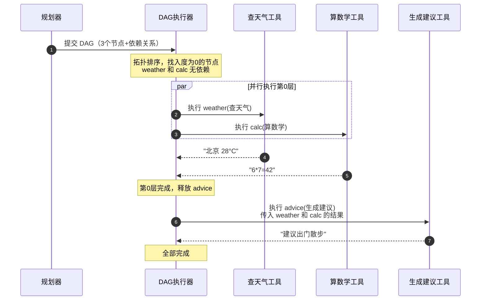
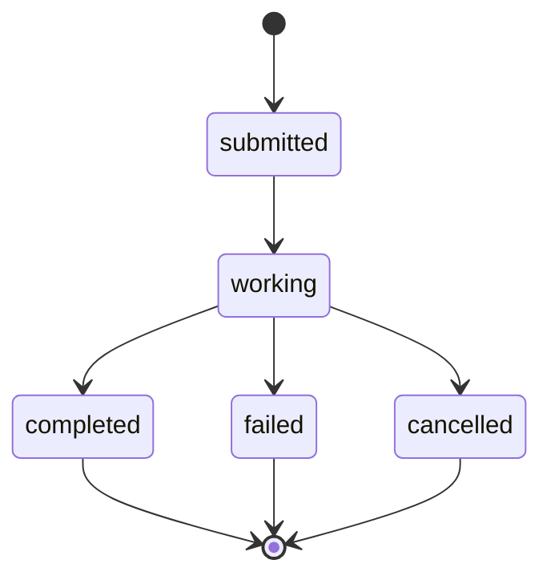
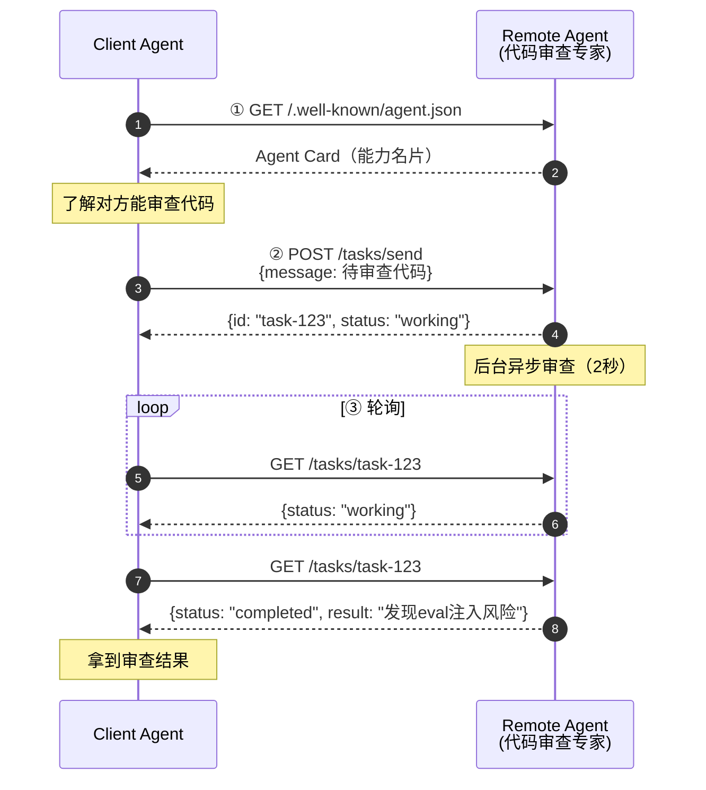

# Agent 开发第五阶段学习笔记：记忆压缩 + 记忆淘汰 + 工具依赖图 + A2A 协议

> 学习目标：掌握 2026 年生产级 Agent 的四个进阶能力——记忆的自我维护、工具依赖调度、Agent 间通信。
>
> 对应代码：`stage5/` 目录（`agent_v5.py`、`v5_memory.py`、`v5_dag.py`、`a2a_server.py`、`a2a_client.py`）

---

## 一、全景总览：四个特性解决什么问题

### 1.1 一张图看懂 V5

```
┌───────────────────────────────────────────────────────────────┐
│                        Agent V5                                │
│                                                               │
│   ┌─────────────────────────────────────────────┐             │
│   │  记忆的「自我维护」                            │             │
│   │    · 记忆压缩：把相关记忆合并成摘要            │             │
│   │      ["喜欢咖啡","喜欢美式","不加糖"]           │             │
│   │        → "喜欢无糖美式咖啡"                    │             │
│   │    · 记忆淘汰：清理过时/不重要记忆             │             │
│   │      "今天穿了蓝衣服" → 🗑️ 删除               │             │
│   └─────────────────────────────────────────────┘             │
│                                                               │
│   ┌─────────────────────────────────────────────┐             │
│   │  工具依赖图（DAG）                            │             │
│   │    查天气 ─┐                                   │             │
│   │            ├─→ 生成建议（有依赖，按序执行）     │             │
│   │    算数学 ─┘                                   │             │
│   └─────────────────────────────────────────────┘             │
│                                                               │
│   ┌─────────────────────────────────────────────┐             │
│   │  A2A 协议（Agent 间通信）                      │             │
│   │    Client Agent ──任务──► Remote Agent        │             │
│   │    （派活）         ◄──结果── （干活）          │             │
│   └─────────────────────────────────────────────┘             │
└───────────────────────────────────────────────────────────────┘
```

### 1.2 四个特性解决什么问题

| 特性 | 解决的痛点 | 一句话理解 |
|------|-----------|-----------|
| 记忆压缩 | 记忆只增不减，越积越多 | 把零散记忆「整理成目录」 |
| 记忆淘汰 | 过时/垃圾记忆污染检索 | 撕掉笔记本里没用的页 |
| 工具依赖图 | 盲目并行导致结果错误 | 有依赖的工具「按序并行」 |
| A2A 协议 | Agent 之间无法协作 | 让 Agent「互相派活」 |

### 1.3 文件分布

```
stage5/
├── agent_v5.py        # 主循环（整合记忆维护）
├── v5_memory.py       # 记忆系统（压缩 + 淘汰）
├── v5_dag.py          # 工具依赖图 DAG 调度器
├── a2a_server.py      # A2A Remote Agent（服务端）
└── a2a_client.py      # A2A Client（客户端）
```

---

## 二、记忆压缩（Consolidation）

### 2.1 为什么需要记忆压缩

V4 的记忆系统有个致命问题：**只增不减**。

```
V4 的问题：
  用户用久了，记忆文件无限膨胀
  → 记忆越来越多，检索越来越慢
  → 大量相关记忆散落各处，检索召回一堆重复信息
  → 超过 LLM 上下文，无法全部注入
```

记忆压缩解决的是：**把零散的相关记忆，合并成一条摘要**。

### 2.2 压缩的直觉

```
压缩前（3 条相关记忆）：
  - 用户喜欢喝咖啡
  - 用户喜欢美式咖啡
  - 用户喝咖啡不加糖

压缩后（1 条摘要）：
  - 用户喜欢喝无糖美式咖啡
```

**数量变少，信息保留**。就像把零散笔记整理成一条目录。

### 2.3 压缩的完整流程

```
┌─────────────────────────────────────────────────┐
│  记忆压缩（consolidate）                          │
│                                                 │
│  ① 按相似度聚类                                 │
│     把内容相近的记忆分到同一组                    │
│                                                 │
│  ② 每组调用 LLM 合并成摘要                       │
│     组A: ["喜欢咖啡","喜欢美式","不加糖"]          │
│       → LLM → "喜欢无糖美式咖啡"                 │
│     组B: ["穿蓝衣服"]（只有一条，不合并）          │
│                                                 │
│  ③ 用摘要替换原始记忆                            │
│     3 条 → 1 条                                  │
└─────────────────────────────────────────────────┘
```

### 2.4 核心代码

```python
def consolidate(self, summarize_fn) -> int:
    """压缩记忆：把相关记忆合并成摘要"""
    # ── 第一步：按相似度聚类 ──
    clusters = []  # 每组是记忆的索引列表
    used = set()
    for i in range(len(self.entries)):
        if i in used:
            continue
        cluster = [i]
        used.add(i)
        # 找和 i 相似的记忆，分到同一组
        for j in range(i + 1, len(self.entries)):
            if j not in used and _cosine(vectors[i], vectors[j]) > 0.3:
                cluster.append(j)
                used.add(j)
        clusters.append(cluster)

    # ── 第二步：每组合并成摘要 ──
    new_entries = []
    for cluster in clusters:
        if len(cluster) == 1:
            new_entries.append(self.entries[cluster[0]])  # 单条不用合并
        else:
            # 多条相关记忆，调用 LLM 摘要
            summary = summarize_fn([...])  # LLM 合并
            new_entries.append({...})
    self.entries = new_entries
```

**关键点**：压缩的「聚类」和「摘要」是两步。聚类靠相似度（代码），摘要靠 LLM（理解语义）。

---

## 三、记忆淘汰（Eviction）

### 3.1 为什么需要记忆淘汰

有些记忆天生没价值：

```
一次性信息（没长期价值）：
  - 用户今天穿了蓝色衣服
  - 用户中午吃了牛肉面
  （这些第二天就没用了，留着只会污染检索）
```

记忆淘汰解决的是：**自动清理这些没价值的记忆**。

### 3.2 淘汰的三个维度评分

淘汰的核心是给每条记忆打一个「保留价值分」，分数越低越先淘汰：

```
保留价值分 = 重要度 × 2 + 时间新鲜度 × 3 + 访问频率
```

| 维度 | 含义 | 直觉 |
|------|------|------|
| 重要度 | 记忆本身多重要（1~5） | 重要的事别删 |
| 时间新鲜度 | 多久没被访问（指数衰减） | 越旧越该删 |
| 访问频率 | 被回忆了多少次 | 常用的别删 |

### 3.3 两种淘汰触发条件

```
触发条件1：时间淘汰
  超过 max_age_days 没被访问，且重要度低（<4）
  → 直接删除

触发条件2：容量淘汰
  记忆数量超过 max_entries
  → 按评分排序，淘汰评分最低的
```

### 3.4 核心代码

```python
def evict(self) -> int:
    """淘汰记忆：删除过时/不重要的"""
    now = time.time()
    kept = []
    removed = 0

    for entry in self.entries:
        age_days = (now - entry["last_access"]) / 86400
        importance = entry["importance"]

        # 条件1：时间淘汰（过时且不重要）
        if age_days > self.max_age_days and importance < 4:
            removed += 1
            continue
        kept.append(entry)

    # 条件2：容量淘汰（超容量按评分删）
    if len(kept) > self.max_entries:
        scored = sorted(kept, key=lambda e: self._retention_score(e, now))
        overflow = len(kept) - self.max_entries
        kept = scored[overflow:]  # 删掉评分最低的
        removed += overflow

    self.entries = kept
    return removed
```

### 3.5 压缩 vs 淘汰的区别

| | 记忆压缩 | 记忆淘汰 |
|--|---------|---------|
| 目的 | 合并相关记忆 | 删除垃圾记忆 |
| 结果 | 数量变少，信息保留 | 数量变少，信息删除 |
| 手段 | LLM 摘要 | 评分排序 |
| 类比 | 整理成目录 | 撕掉废页 |

---

## 四、工具依赖图（DAG）★ 重点 ★

### 4.1 为什么需要工具依赖图

V4 的并行有个粗暴假设：**LLM 同一次返回的所有工具调用都是无依赖的**，可以全部并行。

但真实场景中，工具常常有依赖：

```
有依赖的例子：
  "查用户ID → 用ID查订单 → 根据订单生成报表"

  - 查订单 依赖 查用户ID 的结果（要先有 ID 才能查）
  - 生成报表 依赖 查订单 的结果（要先有订单才能报）

  这三步必须串行，盲目并行会拿到错误结果
```

### 4.2 DAG 是什么

DAG = **Directed Acyclic Graph（有向无环图）**

```
  - 节点（Node）：一个工具调用
  - 边（Edge，有向）：依赖关系
  - A → B 表示「B 依赖 A 的输出」
  - 无环：不能有循环依赖（A 依赖 B，B 又依赖 A 是错的）
```

### 4.3 核心思想：分层并行

把 DAG 分层，同一层的节点（依赖都已满足）可以并行：

```
        ┌─────┐   ┌─────┐
  第0层  │ 查天气│   │ 算数学│    ← 无依赖，并行执行
        └──┬──┘   └──┬──┘
           │          │
           ▼          ▼
        ┌─────────────┐
  第1层  │  生成建议    │    ← 依赖上面两个结果
        └─────────────┘
```

**既保证了依赖顺序，又最大化了并行度。**

### 4.4 完整执行时序图



### 4.5 核心算法：拓扑排序 + 分层并行

```python
class DAGExecutor:
    def execute(self):
        # ── 第一步：计算每个节点的入度（还有几个依赖没完成）──
        in_degree = {nid: len(node.deps) for nid, node in self.nodes.items()}

        # 反向依赖：dep → [依赖它的节点]
        dependents = ...

        # ── 第二步：分层并行 ──
        ready = [nid for nid, deg in in_degree.items() if deg == 0]

        while ready:
            # 这一层的所有节点并行执行
            with ThreadPoolExecutor() as executor:
                # 并行提交所有 ready 节点
                ...
            # 释放后继节点：把依赖它们的入度减1
            next_ready = []
            for nid in ready:
                for dependent in dependents[nid]:
                    in_degree[dependent] -= 1
                    if in_degree[dependent] == 0:
                        next_ready.append(dependent)
            ready = next_ready
```

### 4.6 参数引用：依赖的结果怎么传递

一个节点依赖前驱的结果，怎么拿到？用**占位符引用**：

```python
# 生成建议节点，参数里引用前驱结果
DAGNode(
    node_id="advice",
    tool_name="generate_advice",
    args={
        "weather": "{weather}",   # 引用 weather 节点的结果
        "calc": "{calc}",         # 引用 calc 节点的结果
    },
    deps=["weather", "calc"],     # 声明依赖
)
```

执行时，把 `"{weather}"` 替换成 weather 节点的实际结果：

```python
def _execute_node(self, node):
    resolved_args = {}
    for key, value in node.args.items():
        if value.startswith("{") and value.endswith("}"):
            dep_id = value[1:-1]           # 取出依赖节点 id
            resolved_args[key] = self.nodes[dep_id].result  # 用前驱结果替换
        else:
            resolved_args[key] = value
    return self.tool_map[node.tool_name](**resolved_args)
```

### 4.7 三种失败模式（重点！）

DAG 调度能否成功，完全取决于**依赖图是否正确**：

| 失败模式 | 问题 | 后果 |
|---------|------|------|
| **遗漏依赖边** | 本应顺序执行的被并行 | 结果错误（拿到空值） |
| **虚假依赖边** | 本可并行的被串行 | 悄悄损失性能（更难发现） |
| **隐藏依赖** | 两个分支看起来独立，但共享状态 | 竞态条件、数据损坏 |

**最容易踩坑的是隐藏依赖**：

```
两个工具看起来独立，但都写同一个文件/数据库：
  tool_A：写日志到 app.log
  tool_B：写日志到 app.log
  → 并行执行会竞态，日志互相覆盖

应对：读操作可并行，写操作默认串行
```

### 4.8 何时不该用 DAG

| 场景 | 建议 |
|------|------|
| 本质串行的工作流（每步都依赖上一步） | 串行就好，DAG 只增加复杂度 |
| 非幂等写操作 | 别并行（重复扣款/重复发送） |
| 调试困难 | 并行失败难定位，串行更清晰 |

**工程原则：先串行跑通，测量瓶颈，只在独立的、占延迟主导的片段引入并行。**

---

## 五、A2A 协议（Agent-to-Agent Protocol）★ 重点 ★

### 5.1 为什么需要 A2A

前面学的 MCP 解决的是「Agent 连接工具」，但还有一类问题 MCP 解决不了：

```
问题：多个 Agent 之间怎么协作？

  场景：用户问一个复杂问题
    Agent A（研究员）：负责查资料
    Agent B（程序员）：负责写代码
    Agent C（审查员）：负责审查

  这三个 Agent 之间怎么互相派活、传递结果？
```

**A2A 就是解决这个问题的**——Agent 之间的标准通信协议。

### 5.2 A2A vs MCP（一句话区分）

```
MCP = Agent 的「手」→ 连接外部工具干活
A2A = Agent 的「嘴」→ 和其他 Agent 对话协作
```

| 维度 | MCP | A2A |
|------|-----|-----|
| 发起者 | Anthropic | Google |
| 定位 | Agent 连工具/数据 | Agent 连 Agent |
| 通信双方 | Agent ↔ 工具 | Agent A ↔ Agent B |
| 状态 | 无状态 | 有状态（任务状态机） |
| 2026 状态 | 事实标准 | 新兴标准，Google 主推 |

**两者互补，不冲突**：生产系统常「A2A 管协作，MCP 管工具」。

### 5.3 三个核心实体

```
┌─────────────┐          ┌──────────────┐
│ Client Agent │ ─任务──► │ Remote Agent │
│ （发起者）    │ ◄─结果── │ （执行者）    │
│ 项目经理     │          │ 团队成员      │
└─────────────┘          └──────────────┘
       双方围绕一个「Task（任务工单）」协作
```

### 5.4 四个 HTTP 端点

| 端点 | HTTP方法 | 作用 | 类比 |
|------|---------|------|------|
| `/.well-known/agent.json` | GET | 获取 Agent Card（能力名片） | 递名片 |
| `/tasks/send` | POST | 发送任务 | 派活 |
| `/tasks/{id}` | GET | 查询任务状态 | 催进度 |
| `/tasks/{id}/cancel` | POST | 取消任务 | 撤回 |

### 5.5 任务状态机

```
submitted → working → completed
                   ↘ failed
                   ↘ cancelled
```



### 5.6 Agent Card（数字名片）

每个 Agent 通过一个 JSON 名片声明自己的能力：

```json
{
  "name": "Code Review Agent",
  "description": "专业的代码审查专家",
  "version": "1.0.0",
  "capabilities": [
    {
      "id": "code_review",
      "name": "代码审查",
      "description": "审查代码，找出 bug 和安全隐患"
    }
  ],
  "endpoint": "http://localhost:8000"
}
```

**Client 先 GET 这个名片，才知道 Remote Agent 能干什么、要不要派活给它。**

### 5.7 完整时序图（A2A 全流程）



### 5.8 核心代码：服务端（Remote Agent）

```python
from fastapi import FastAPI
app = FastAPI()

# ① Agent Card
@app.get("/.well-known/agent.json")
def get_agent_card():
    return AGENT_CARD.model_dump()

# ② 发送任务
@app.post("/tasks/send")
def send_task(request: TaskRequest):
    task_id = str(uuid.uuid4())
    tasks[task_id] = {"status": "working", "message": request.message}
    # 后台线程异步处理
    threading.Thread(target=_process_task, args=(task_id,)).start()
    return {"id": task_id, "status": "working"}

# ③ 查询状态
@app.get("/tasks/{task_id}")
def get_task(task_id: str):
    return {"id": task_id, "status": tasks[task_id]["status"], ...}

# ④ 取消任务
@app.post("/tasks/{task_id}/cancel")
def cancel_task(task_id: str):
    tasks[task_id]["status"] = "cancelled"
    return {"id": task_id, "status": "cancelled"}
```

### 5.9 核心代码：客户端（Client Agent）

```python
class A2AClient:
    def execute(self, message, poll_interval=0.5):
        # ① 发现能力
        card = self.discover()          # GET agent.json

        # ② 发送任务
        resp = self.send_task(message)  # POST /tasks/send
        task_id = resp["id"]

        # ③ 轮询状态
        while True:
            task = self.get_task(task_id)  # GET /tasks/{id}
            if task["status"] == "completed":
                return task["result"]
            time.sleep(poll_interval)
```

### 5.10 A2A 的关键设计特点

| 特点 | 说明 |
|------|------|
| 异步任务 | 任务在后台处理，Client 轮询（不是同步等待） |
| 状态可查询 | 随时能查任务进度 |
| 可取消 | 不想要了能撤回 |
| 能力发现 | 通过 Agent Card 动态发现对方能力 |
| 跨框架 | 任何语言/框架的 Agent 都能通信 |

### 5.11 A2A 的局限（2026 年）

- 生态成熟度低（相比 MCP）
- 异步流式响应复杂（本教程只演示了轮询）
- 多 Agent 发现机制弱（Agent Card 是静态 JSON，需配合服务注册中心）

---

## 六、运行方式

### 6.1 安装依赖

```bash
pip install -r requirements.txt
# 新增：fastapi、uvicorn、requests
```

### 6.2 运行

```bash
# 记忆系统独立测试（零依赖，先跑这个）
python stage5/v5_memory.py

# 工具依赖图独立测试（零依赖）
python stage5/v5_dag.py

# 主循环（含记忆维护，需要 LLM）
python stage5/agent_v5.py
python stage5/agent_v5.py --mode dag   # DAG 演示

# A2A 协议（需要两个进程）
python stage5/a2a_server.py            # 先启动服务端
python stage5/a2a_client.py            # 再跑客户端
```

### 6.3 VSCode 调试

`.vscode/launch.json` 已配置 4 个 stage5 入口，按 F5 选择即可。

### 6.4 断点建议

| 位置 | 看什么 |
|------|--------|
| `consolidate()` 的聚类循环 | 相关记忆怎么被分组 |
| `evict()` 的评分排序 | 哪条记忆评分最低被淘汰 |
| `DAGExecutor.execute()` 的 ready 队列 | 每层哪些节点并行 |
| `_execute_node()` 的参数替换 | `{weather}` 怎么被替换 |
| `a2a_server.py` 的 `send_task` | 任务怎么被接收 |
| `a2a_client.py` 的轮询循环 | 状态怎么从 working 变 completed |

---

## 七、核心认知总结

### 7.1 四个特性的本质

```
记忆压缩 = 给记忆加「整理能力」
  → 不是不记了，而是把零散的相关记忆合并成摘要

记忆淘汰 = 给记忆加「清理能力」
  → 不是记不住，而是主动删掉没价值的记忆

工具依赖图 = 给并行加「依赖感知」
  → 不是简单并行，而是按依赖关系智能调度

A2A = 给 Agent 加「协作能力」
  → 不是单打独斗，而是 Agent 之间互相派活
```

### 7.2 记忆的完整生命周期（本阶段核心）

```
  remember（记） → recall（忆） → consolidate（压缩） → evict（淘汰）
      ↑                                                  ↓
      └──────────── 下一次会话，记忆保持「小而精」 ←─────────┘
```

### 7.3 依赖关系的核心判断

> **对每个工具调用，问一句：这个调用需要另一个调用的输出吗？**
> - 需要 → 建立依赖边，串行
> - 不需要 → 可以并行

这个判断是 DAG 调度的灵魂。判断错了，要么结果错误（遗漏依赖），要么性能损失（虚假依赖）。

### 7.4 与前面阶段的关系

```
阶段1-2：Agent 会「做事」（工具调用 + 工程化）
阶段3：Agent 会「策略」（规划、分工、实时）
阶段4：Agent 会「记忆 + 安全 + 标准」（记忆、HITL、MCP）
阶段5：Agent 会「自我维护 + 协作」（压缩淘汰、依赖调度、A2A）
```

到这里，你已经走完了 Agent 开发的**完整核心能力图谱**。

---

## 八、下一阶段方向（进阶）

| 方向 | 内容 | 难度 |
|------|------|------|
| 记忆向量化 | 记忆用 embedding 存向量数据库，语义检索 | ★★★ |
| 自动记忆整合 | 后台定时任务自动压缩/淘汰 | ★★★ |
| LLMCompiler 完整实现 | 规划器自动生成 DAG + 动态重规划 | ★★★★ |
| A2A 流式响应 | SSE 实时推送任务进度 | ★★★★ |
| 多 Agent 编排 | 多个 Agent 通过 A2A 组网协作 | ★★★★★ |
| 可观测性 | LangSmith / Langfuse 全链路追踪 | ★★★ |

---

## 附录：第五阶段术语速查

| 术语 | 含义 |
|------|------|
| 记忆压缩（Consolidation） | 把相关记忆合并成摘要 |
| 记忆淘汰（Eviction） | 删除过时/不重要的记忆 |
| 时间衰减 | 越旧的记忆价值越低 |
| DAG | 有向无环图，表示依赖关系 |
| 拓扑排序 | 按依赖关系排序节点 |
| 入度 | 一个节点还有几个依赖没完成 |
| 分层并行 | 同一层（依赖满足）的节点并行执行 |
| 参数引用 | 用 `{依赖id}` 引用前驱结果 |
| A2A | Agent-to-Agent Protocol，Agent 间通信协议 |
| Agent Card | Agent 的能力名片（JSON） |
| Task | A2A 的任务抽象，有状态机 |
| Client Agent | 发起任务的 Agent |
| Remote Agent | 执行任务的 Agent |
| 轮询（Polling） | 定期查询任务状态 |
