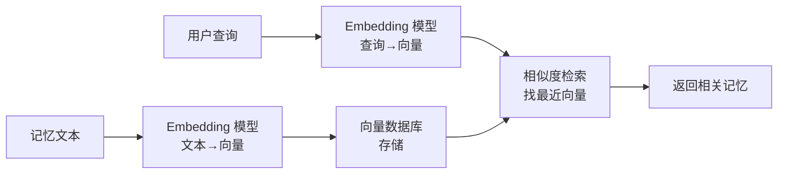
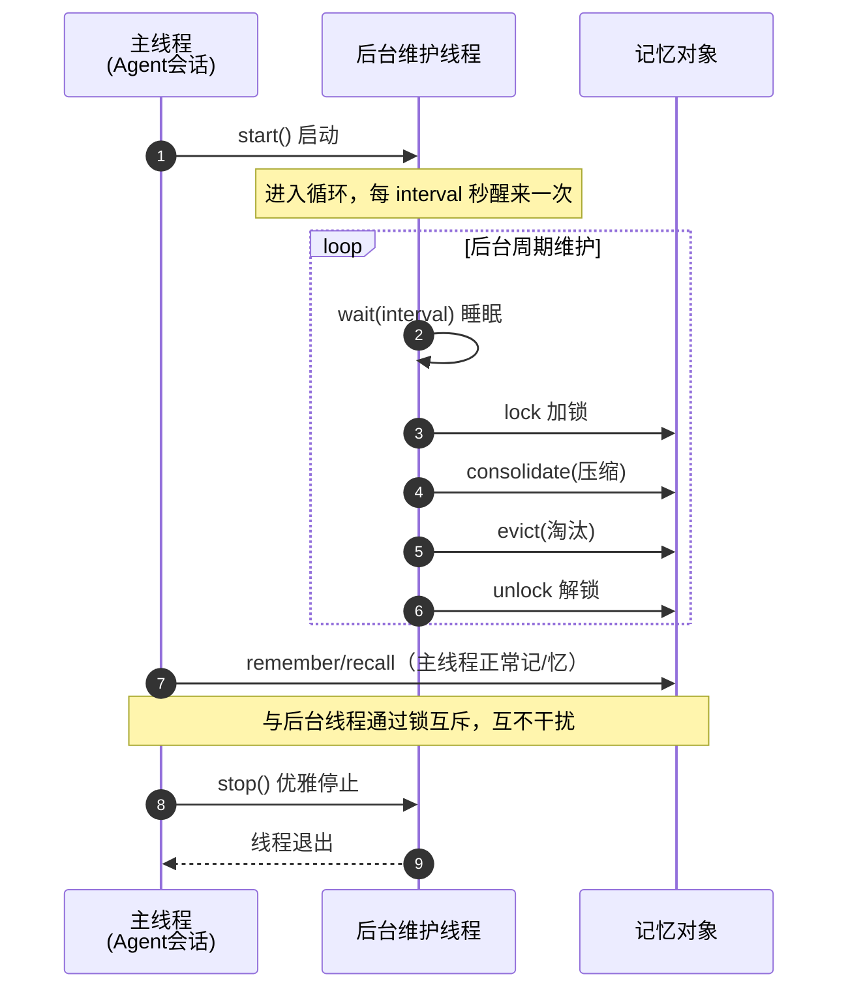
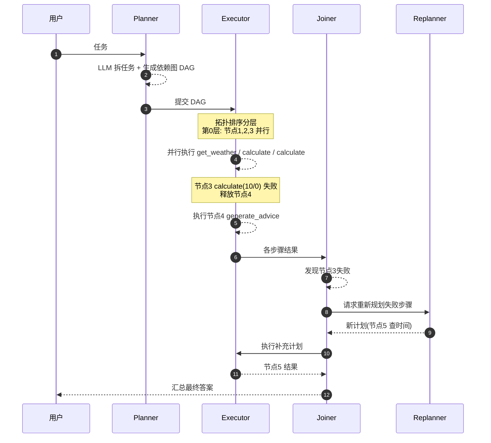
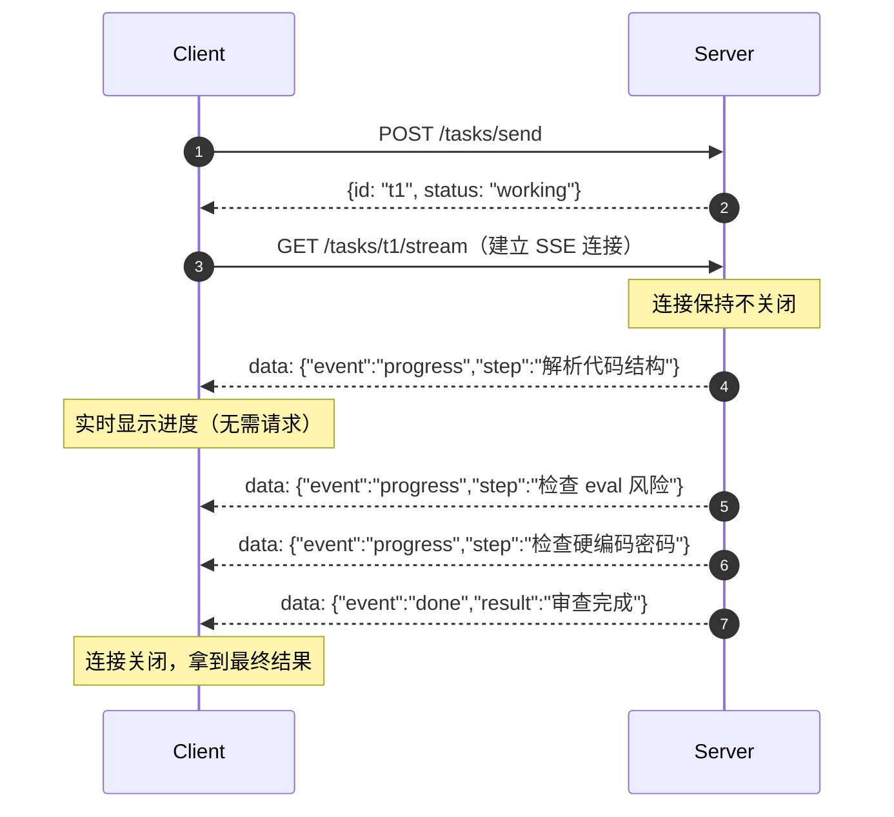
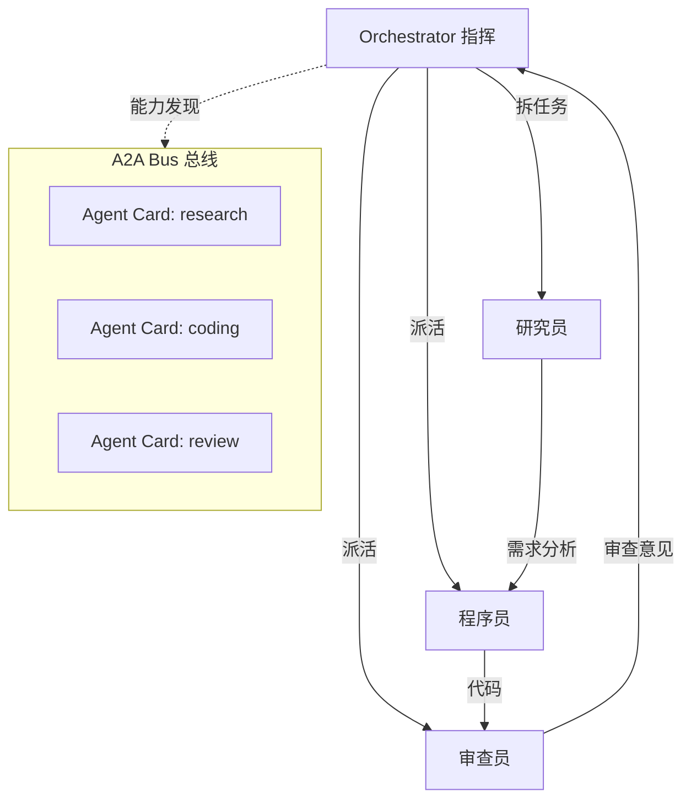

# Agent 开发第六阶段学习笔记：生产级进阶（向量化 + 自动整合 + LLMCompiler + 流式 + 编排 + 可观测）

> 学习目标：在完整掌握前五阶段的基础上，掌握六个「从能用到好用」的生产级进阶能力——语义检索、自动化维护、LLM 自动规划、流式通信、多 Agent 编排、全链路可观测。
>
> 对应代码：`stage6/` 目录（`v6_embedding.py`、`v6_scheduler.py`、`v6_llm_compiler.py`、`v6_a2a_stream.py`、`v6_orchestrator.py`、`v6_observability.py`）
>
> 本阶段难度：★★★ ~ ★★★★★，建议按顺序逐个吃透。

---

## 一、全景总览：六个方向解决什么问题

### 1.1 一张图看懂 V6

```
┌──────────────────────────────────────────────────────────────────┐
│                        Agent V6（生产级进阶）                       │
│                                                                  │
│  ┌──────────────────┐  ┌──────────────────┐  ┌──────────────────┐│
│  │ 方向1 记忆向量化  │  │ 方向2 自动整合    │  │ 方向3 LLMCompiler ││
│  │ TF-IDF → 语义    │  │ 手动维护 → 后台    │  │ 手工DAG → 自动   ││
│  │ "咖啡"≈"拿铁"    │  │ 定时任务          │  │ 生成依赖图        ││
│  └──────────────────┘  └──────────────────┘  └──────────────────┘│
│                                                                  │
│  ┌──────────────────┐  ┌──────────────────┐  ┌──────────────────┐│
│  │ 方向4 A2A流式     │  │ 方向5 多Agent编排 │  │ 方向6 可观测性    ││
│  │ 轮询 → SSE推送    │  │ 单打独斗 → 组网   │  │ 黑盒 → 全链路追踪││
│  │ 服务端主动推进度  │  │ 指挥调度多专家    │  │ Trace/Span 定位  ││
│  └──────────────────┘  └──────────────────┘  └──────────────────┘│
└──────────────────────────────────────────────────────────────────┘
```

### 1.2 六个方向解决什么问题

| 方向 | 解决的痛点 | 一句话理解 | 难度 |
|------|-----------|-----------|------|
| 记忆向量化 | TF-IDF 只能字面匹配，认不出"咖啡≈拿铁" | 用向量衡量语义 | ★★★ |
| 自动记忆整合 | 压缩/淘汰靠手动触发，不及时 | 后台线程定时维护 | ★★★ |
| LLMCompiler | DAG 依赖图靠人工手画，无法应对千变万化的问题 | 让 LLM 自动画依赖图 | ★★★★ |
| A2A 流式响应 | 轮询反复空问、拿不到中间进度 | 服务端主动推送 | ★★★★ |
| 多 Agent 编排 | 一个 Agent 干所有事，prompt 冲突 | 指挥 + 多专家分工 | ★★★★★ |
| 可观测性 | Agent 是黑盒，出错难定位 | 给每一步装摄像头 | ★★★ |

### 1.3 与前面阶段的关系

```
阶段1-2：Agent 会「做事」      → 工具调用 + 工程化 + RAG
阶段3：  Agent 会「策略」      → 规划、分工、流式
阶段4：  Agent 会「记忆+标准」 → 记忆、HITL、MCP
阶段5：  Agent 会「维护+协作」 → 压缩淘汰、DAG、A2A
阶段6：  Agent 会「生产化」    → 语义检索、自动化、自规划、编排、可观测
```

前五阶段帮你「造出一台能跑的机器」，第六阶段帮你「把这台机器调校到能上线」。

### 1.4 文件分布

```
stage6/
├── v6_embedding.py       # 方向1：记忆向量化（embedding + 向量库）
├── v6_scheduler.py       # 方向2：自动记忆整合（后台定时任务）
├── v6_llm_compiler.py    # 方向3：LLMCompiler（LLM 自动生成 DAG）
├── v6_a2a_stream.py      # 方向4：A2A 流式响应（SSE）
├── v6_orchestrator.py    # 方向5：多 Agent 编排
└── v6_observability.py   # 方向6：可观测性（Trace/Span）
```

---

## 二、方向1：记忆向量化（Embedding 语义检索）★★★

### 2.1 为什么 TF-IDF 不够用

第五阶段的记忆检索用 **TF-IDF + 余弦相似度**。它有一个根本性的局限：

> **TF-IDF 只认识「字面相同的词」，不认识「语义相近的词」。**

看一个例子：

```
记忆库里存着：  "用户爱喝咖啡"
用户这次问：    "你喜欢喝什么饮料？"

TF-IDF 的视角（字面匹配）：
  查询分词 → [你, 喜, 欢, 喝, 什, 么, 饮, 料]
  记忆分词 → [用, 户, 爱, 喝, 咖, 啡]
  两个句子只有「喝」一个字重合 → 相似度极低 → 检索不到 ❌
```

这就是「字面匹配」的天花板：换个说法就认不出来了。

### 2.2 Embedding 是什么

**Embedding = 把一段文字变成一串数字（向量）。**

它最核心的特性是：

> **语义相近的文字，向量也相近（在向量空间里离得近）。**

```
在一个训练好的 embedding 模型里：

  「咖啡」→ 向量 [0.12, -0.45, 0.83, ...]
  「拿铁」→ 向量 [0.11, -0.43, 0.80, ...]   ← 和「咖啡」很近
  「数学」→ 向量 [0.91, 0.32, -0.15, ...]   ← 和「咖啡」很远

甚至可以向量运算：
  国王 - 男人 + 女人 ≈ 王后
```

所以用 embedding 检索时，"喜欢喝什么饮料" 和 "爱喝咖啡" 这两个语义相近的句子，向量距离很近，能被互相检索到。

### 2.3 向量数据库是什么

**向量数据库 = 专门存向量 + 快速找「最相似的 N 个向量」的数据库。**

```
普通数据库：  WHERE name = '张三'          → 精确匹配
向量数据库：  WHERE vector ≈ [0.1, 0.2...]  → 相似度匹配（近似最近邻）

生产方案：FAISS / Chroma / Milvus / Qdrant
本教程：VectorStore（暴力搜索，只适合几百条以内的教学演示）
```

### 2.4 完整流程



对比第五阶段的 RAG/记忆流程，**唯一的变化就是把「TF-IDF 向量化」换成「embedding 向量化」**，其余（存储、检索、相似度计算）完全一样。这也是为什么本阶段能平滑衔接。

### 2.5 核心代码

```python
class EmbeddingProvider:
    """统一「文本 → 向量」接口（依赖倒置）"""
    def embed(self, texts) -> list[list[float]]: ...
    def embed_one(self, text) -> list[float]: ...

class VectorStore:
    """极简向量数据库：add 存、search 查"""
    def add(self, entry_id, content):
        vec = self.embedding.embed_one(content)
        self.entries.append({...})

    def search(self, query, top_k=3):
        q = self.embedding.embed_one(query)
        # 和每条记忆算余弦相似度，取 top_k
        scored.sort(key=lambda x: x["score"], reverse=True)
        return scored[:top_k]
```

本教程实现了一个零依赖的 `HashNGramEmbedding`（字符 n-gram 哈希），它虽然不如真实 embedding 模型精准，但能离线跑、完整展示「向量化 + 相似度检索」的链路。真实项目用 `OpenAIEmbedding`（接 `text-embedding-3-small`）。

### 2.6 一个关键细节：为什么用 hashlib 而不是 hash()

这是一个很容易踩的坑：

```python
# ❌ 错误：Python 内置 hash() 对字符串的结果每次启动都不同
idx = hash("咖啡") % 256    # 这次是 42，下次可能就是 137

# ✅ 正确：hashlib 是确定性算法，永远稳定
idx = int(hashlib.md5("咖啡".encode()).hexdigest(), 16) % 256
```

Python 的 `hash()` 受 `PYTHONHASHSEED` 随机化影响，每次启动进程结果都不同。如果用了它，**这次存的向量和下次查的向量对不上**，检索就失效了。

### 2.7 对比实验（跑起来看）

运行 `python stage6/v6_embedding.py`，你会看到：

```
① TF-IDF 检索结果：相关度 0.xxx（检索不到"用户喜欢喝咖啡"）
② Embedding 检索结果：相关度 0.xxx  用户喜欢喝咖啡  ← 排第一！
```

**核心收获**：TF-IDF 和 embedding 的差别，本质是「字面匹配」vs「语义匹配」。

---

## 三、方向2：自动记忆整合（后台定时任务）★★★

### 3.1 为什么需要自动化

第五阶段的记忆压缩/淘汰，是在**每次会话结束时手动触发**的：

```
V5 的问题：
  run_agent 里：
    会话结束 → memory.consolidate()   # 手动压缩
             → memory.evict()         # 手动淘汰
```

这在「单用户 + 短会话」下没问题，但生产环境有缺陷：

1. **没会话就不维护**：半夜、周末 Agent 空闲时，记忆一直不整理
2. **开会话时卡顿**：记忆膨胀到很大，用户一开新会话就要先卡顿地压缩一顿
3. **耦合**：维护和主流程绑在一起，主流程一忙就漏维护

### 3.2 架构：把维护从主流程剥离

解决方案是引入一个**后台守护线程**，像手机系统后台定期清理缓存：

```
┌──────────────────────────────────────────────┐
│  主线程（Agent 主循环）                        │
│    · 只负责「记」和「忆」                      │
│    · 不关心什么时候压缩、什么时候淘汰           │
└──────────────────────────────────────────────┘
                        ↑ 共享同一个 memory 对象
┌──────────────────────────────────────────────┐
│  后台守护线程（维护调度器）                     │
│    · 每 interval 秒醒来一次                    │
│    · 自动 consolidate（压缩）                  │
│    · 自动 evict（淘汰）                        │
└──────────────────────────────────────────────┘
```

### 3.3 线程安全为什么重要

主线程在「记/忆」，后台线程在「压缩/淘汰」，**两个线程同时操作同一个列表**，不加锁会出「竞态条件」：

```
危险场景：
  后台线程正在删记忆条目，主线程刚好在遍历记忆
  → 列表长度变了，遍历越界 → 崩溃或漏数据
```

所以本方向用 `threading.Lock` 保护所有对记忆的写操作。

### 3.4 核心代码

```python
class MemoryMaintenanceScheduler:
    def _loop(self):
        while not self._stop_event.is_set():
            self._stop_event.wait(self.interval)   # 睡 interval 秒
            if self._stop_event.is_set():
                break
            self.maintain()                        # 醒来维护一次

    def maintain(self):
        with self._lock:                            # 加锁，防竞态
            removed = self.memory.consolidate(self.summarize_fn)
            evicted = self.memory.evict()
        return removed, evicted
```

**两个设计要点**：

1. `Event.wait(timeout)` 代替 `sleep()`：既能定时醒来，又能在 `stop()` 时**立刻**退出，不用等下一个周期
2. `daemon=True`：主线程退出时，后台线程自动被回收，不会卡住程序

### 3.5 时序图



---

## 四、方向3：LLMCompiler（LLM 自动生成 DAG）★★★★

### 4.1 从手工 DAG 到自动 DAG

第五阶段的 DAG 是**人工手画**的：

```python
# V5：人肉指定每个节点和依赖
nodes = [
    DAGNode("weather", "get_weather", {"city": "北京"}, deps=[]),
    DAGNode("calc", "calculate", {"expression": "6*7"}, deps=[]),
    DAGNode("advice", "generate_advice", {"weather": "{weather}", "calc": "{calc}"},
            deps=["weather", "calc"]),
]
```

这在「任务固定」时没问题。但用户的真实问题是**千变万化**的，不可能每次都为新问题手写一份 DAG。

**LLMCompiler（斯坦福 ICML 2024）的核心思想一句话**：

> **让 LLM 同时做两件事：拆任务 + 画依赖图，一次输出。**

### 4.2 三个角色 + 一个重规划

```
┌────────────┐    ┌────────────┐    ┌────────────┐
│  Planner   │ →  │  Executor  │ →  │   Joiner   │
│  LLM 拆任务 │    │  按 DAG     │    │  LLM 汇总   │
│  + 画依赖图 │    │  分层并行   │    │  最终答案   │
└────────────┘    └────────────┘    └────────────┘
      ▲                                   │
      │         ┌────────────┐            │
      └──────── │ Replanner  │◄───────────┘
                │ 失败时重规划 │
                └────────────┘
```

| 角色 | 职责 | 由谁实现 |
|------|------|---------|
| Planner | 把任务拆成带依赖的 DAG | LLM |
| Executor | 按拓扑排序分层并行执行 | 代码（复用 stage5） |
| Joiner | 把各步骤结果汇总成答案 | LLM |
| Replanner | 某步骤失败时重新规划 | LLM |

### 4.3 关键：让 LLM 输出「带依赖的 JSON」

Planner 的 prompt 是关键。它要求 LLM 输出这样的结构：

```json
[
  {"id": "1", "tool": "get_weather", "args": {"city": "北京"}, "deps": []},
  {"id": "2", "tool": "calculate", "args": {"expression": "6*7"}, "deps": []},
  {"id": "3", "tool": "generate_advice",
   "args": {"weather": "{1}", "calc": "{2}"}, "deps": ["1", "2"]}
]
```

几个要点：

- `deps` 数组显式声明依赖关系
- `args` 里用 `"{1}"` 这种占位符引用前驱步骤的结果
- 判断依赖的唯一标准：**这一步需要上一步的输出吗？**

### 4.4 动态重规划（比静态规划更先进）

执行过程中某一步失败（比如除法除以 0），Replanner 会**只重新规划失败的部分**，而不是全部重来：

```
初始 DAG：
  1 get_weather    ✅
  2 calculate 6*7  ✅
  3 calculate 10/0 ❌ 失败！
  4 generate_advice ✅

Joiner 检测到节点 3 失败
  → Replanner 重新规划：节点 3 改成查当前时间
  → 只重跑新规划的节点
  → Joiner 汇总（忽略失败的结果）
```

### 4.5 完整时序图



### 4.6 核心代码（流程编排）

```python
def run_compiler(task, client=None, model=None, max_replans=2):
    # ① Planner 生成 DAG
    plan = LLMCompilerPlanner.plan(task, client, model)

    all_results = {}
    for replan_count in range(max_replans + 1):
        # ② Executor 分层并行执行
        executor = DAGExecutor(_build_dag(plan), TOOL_MAP)
        results = executor.execute()
        all_results.update(results)

        # ③ 检查失败 → 触发重规划
        failed = _find_failed(results)
        if not failed:
            break
        plan = LLMCompilerReplanner.replan(task, failed, all_results, client, model)

    # ④ Joiner 汇总
    return LLMCompilerJoiner.join(task, all_results, client, model)
```

### 4.7 LLMCompiler 的局限（要知道）

- **LLM 生成的依赖图可能出错**：LLM 可能漏标依赖（导致并行拿错值）或多标依赖（损失性能）
- **解析脆弱**：要求 LLM 严格输出 JSON，一旦格式不对要降级处理
- **适用边界**：适合「可并行子任务多」的任务；本质串行的任务用它反而复杂

---

## 五、方向4：A2A 流式响应（SSE）★★★★

### 5.1 轮询 vs SSE

第五阶段的 A2A 客户端用**轮询（polling）**拿结果：

```
轮询 = 客户端反复敲门问「好了吗？」
  Client → GET /tasks/{id} → "working"
  等 0.5 秒
  Client → GET /tasks/{id} → "working"
  等 0.5 秒
  ...一直空问到 completed
```

轮询的三个问题：

1. **低效**：任务还在跑时，客户端一直在空发请求
2. **有延迟**：最多要等一个轮询周期才知道结果出来了
3. **拿不到中间进度**：只能看到 `working → completed`，看不到细节

**SSE（Server-Sent Events）** 反过来：

```
SSE = 服务端主动说「我进行到 X 了」
  Server → data: {"event":"progress","step":"检查 eval"}
  Server → data: {"event":"progress","step":"检查密码"}
  Server → data: {"event":"done","result":"审查完成"}
```

### 5.2 SSE 是什么

SSE 是 HTTP 的一种用法：**服务端保持连接不关闭，持续往客户端推数据**。

```
轮询 = 客户端主动拉（pull）
SSE  = 服务端主动推（push）
```

### 5.3 SSE 报文格式

服务端持续发送这样的文本块（**两个换行符**分隔事件）：

```
data: {"event": "progress", "step": "正在检查 eval 风险"}

data: {"event": "done", "result": "审查完成..."}

```

客户端用**流式 HTTP 请求**逐行读取，实时收到每一条推送。

### 5.4 核心代码

**服务端**（FastAPI + StreamingResponse）：

```python
@app.get("/tasks/{task_id}/stream")
async def stream_task(task_id: str):
    async def event_generator():
        # 边审查边推送进度
        for step in steps:
            await asyncio.sleep(0.6)
            yield sse_event("progress", {"step": step})
        yield sse_event("done", {"result": result})

    # text/event-stream 是 SSE 的关键标识
    return StreamingResponse(event_generator(), media_type="text/event-stream")
```

**客户端**（requests 流式读取）：

```python
with requests.get(url, stream=True) as r:
    for line in r.iter_lines(decode_unicode=True):
        if line.startswith("data:"):
            payload = json.loads(line[5:].strip())
            # 实时处理每一条推送
```

### 5.5 时序图



---

## 六、方向5：多 Agent 编排 ★★★★★

### 6.1 为什么需要编排

前面学的是「一个 Agent 干所有事」。但真实业务里，复杂任务需要多种能力协作：

```
一个复杂任务"写代码并审查"，需要三种能力：
  - 研究员：理解需求
  - 程序员：写代码
  - 审查员：挑毛病
```

如果塞进一个 Agent，会出现：

- system prompt 又长又冲突
- 工具混在一起，效率低
- 一个 prompt 没法同时扮演三个角色

### 6.2 Orchestrator 模式（指挥 + 专家）

**编排 = 一个「指挥」拆任务、派活、汇总，自己不下场干活。**

```
┌─────────────────────────────────────────────┐
│              Orchestrator（指挥）             │
│   拆任务 → 找合适的 Agent → 派活 → 汇总       │
└──────┬──────────────┬──────────────┬─────────┘
       ▼              ▼              ▼
┌────────────┐ ┌────────────┐ ┌────────────┐
│ Researcher │ │   Coder    │ │  Reviewer  │
│  (研究员)   │ │  (程序员)   │ │  (审查员)   │
└────────────┘ └────────────┘ └────────────┘
```

### 6.3 两种编排模式

**① 流水线（Pipeline）**：上游输出 → 下游输入，串行

```
研究员理解需求 → 程序员写代码 → 审查员审查
     ↑输出               ↑输入上一级结果
```

**② 能力路由（Routing）**：按任务类型，选一个最合适的 Agent

```
"查资料" → 研究员；"写代码" → 程序员
```

### 6.4 能力发现（复用 A2A 的 Agent Card）

每个 Agent 通过**能力名片**声明自己会干什么，Orchestrator 靠它决定「该找谁」：

```
Agent Card（能力名片）：
  Researcher: capabilities = ["research"]
  Coder:      capabilities = ["coding"]
  Reviewer:   capabilities = ["review"]

Orchestrator.discover("coding") → 找到 Coder
```

这就是第五阶段 A2A 里 `Agent Card` 思想的落地应用。

### 6.5 核心代码

```python
class A2ABus:
    """迷你总线：注册 / 发现 / 派发（模拟真实 A2A 网络）"""
    def discover(self, capability):
        for agent in self.agents:
            if capability in agent.card.capabilities:
                return agent

class Orchestrator:
    def run_pipeline(self, task):
        # ① 研究员理解需求
        analysis = self.bus.send(self.bus.discover("research"), task)
        # ② 程序员写代码（输入是需求分析）
        code = self.bus.send(self.bus.discover("coding"), analysis)
        # ③ 审查员审查（输入是代码）
        return self.bus.send(self.bus.discover("review"), code)
```

### 6.6 架构图



**关键认知**：编排的价值不在于「多个 LLM 调用」，而在于**职责分离 + 可独立升级**。每个专家 Agent 可以单独优化、单独替换，指挥逻辑保持稳定。

---

## 七、方向6：可观测性（全链路追踪）★★★

### 7.1 为什么需要可观测

随着阶段推进，Agent 越来越复杂：

```
一次任务可能：
  - 调用多次 LLM（规划、执行、反思、汇总）
  - 每次 LLM 又调用多个工具
  - 多 Agent 编排下，一次请求跨越多个 Agent
```

一旦结果不对，你面对的是一个**黑盒**：不知道是 LLM 决策错了、工具调用错了、还是某一步超时了。

**可观测性 = 给黑盒装摄像头。**

### 7.2 核心概念：Trace 和 Span

可观测性领域（借鉴分布式追踪 OpenTelemetry）有两个核心概念：

```
Trace（追踪）= 一次完整请求的完整记录
Span（片段）= Trace 里的一个最小单元（一次 LLM 调用 / 一次工具调用）

关系（Span 可嵌套，形成调用树）：

  Trace: 处理任务
   ├── Span: LLM 规划（200ms, 150 tokens）
   ├── Span: 工具 get_weather（5ms）
   ├── Span: 工具 calculate（3ms）
   └── Span: LLM 汇总（180ms, 120 tokens）
```

每个 Span 记录：**名字、类型、开始/结束时间、输入、输出、标签**（token 数、model 名等）。

### 7.3 轻量 Tracer 实现

本教程实现了一个轻量 Tracer，核心是 **context manager 自动计时**：

```python
class Tracer:
    @contextmanager
    def span(self, name, span_type, **tags):
        s = Span(name, span_type)
        # 挂到父 Span（或顶层）
        if self._stack:
            self._stack[-1].children.append(s)
        else:
            self.root_spans.append(s)
        self._stack.append(s)
        try:
            yield s                      # 交给调用方填 input/output
        finally:
            s.end = time.time()          # 自动记录结束时间
            self._stack.pop()
```

**用法**（把真实调用包进 span）：

```python
with tracer.span("LLM:规划", "llm", model="gpt-4") as s:
    s.input = messages
    response = client.chat.completions.create(...)
    s.output = response.choices[0].message.content
    s.tags["tokens"] = response.usage.total_tokens
```

### 7.4 生产方案：LangSmith / Langfuse

工业界有成熟的可观测平台：

| 平台 | 说明 |
|------|------|
| LangSmith | LangChain 生态，可视化 Trace/Span、token 消耗、成本 |
| Langfuse | 开源，可自托管，类似功能 |

它们都能把 Trace/Span 树可视化展示。**理解了本教程的 Trace/Span 概念，再上手这些平台会非常快**——它们的核心概念完全一致，只是多了 UI 面板和上报接口。

### 7.5 追踪树示例

运行 `python stage6/v6_observability.py`，会输出：

```
📊 全链路追踪报告（Trace）
└─ 🤖 处理任务 (201.5ms)
   ├─ 🧠 LLM:规划 (100.1ms) [model=gpt-4o-mini, tokens=150]
   ├─ 🔧 工具:get_weather (30.2ms)
   ├─ 🔧 工具:calculate (30.1ms)
   └─ 🧠 LLM:汇总 (100.3ms) [model=gpt-4o-mini, tokens=120]
───
📈 汇总：共 5 个 Span，LLM 调用 2 次，工具调用 2 次，累计耗时 ...
```

**出问题时**，你能一眼看出：是哪一步最慢、哪一步 token 异常、哪一步输出不对。

---

## 八、运行方式

### 8.1 安装依赖

```bash
pip install -r requirements.txt
# 本阶段复用现有依赖：openai、mcp、fastapi、uvicorn、requests
# 零依赖可跑的：v6_embedding / v6_orchestrator / v6_observability
```

### 8.2 运行

```bash
# 方向1：记忆向量化（零依赖，先跑这个）
python stage6/v6_embedding.py

# 方向2：自动记忆整合（零依赖，复用 stage5 记忆）
python stage6/v6_scheduler.py

# 方向3：LLMCompiler
python stage6/v6_llm_compiler.py --demo   # 零依赖，模拟 LLM 看完整流程
python stage6/v6_llm_compiler.py          # 真实 LLM（需 config.json）

# 方向4：A2A 流式响应（两个终端）
python stage6/v6_a2a_stream.py --mode server
python stage6/v6_a2a_stream.py --mode client

# 方向5：多 Agent 编排（零依赖）
python stage6/v6_orchestrator.py

# 方向6：可观测性（零依赖）
python stage6/v6_observability.py
```

### 8.3 断点建议

| 位置 | 看什么 |
|------|--------|
| `v6_embedding.py` 的 `HashNGramEmbedding._embed_one` | 文本怎么变成向量 |
| `v6_embedding.py` 的 `VectorStore.search` | 相似度怎么算、怎么排序 |
| `v6_scheduler.py` 的 `_loop` | 后台线程怎么定时醒来 |
| `v6_scheduler.py` 的 `maintain` | 锁怎么保护写操作 |
| `v6_llm_compiler.py` 的 `_build_dag` | LLM 的 JSON 怎么变成 DAGNode |
| `v6_llm_compiler.py` 的 `_find_failed` | 失败怎么被检测到 |
| `v6_a2a_stream.py` 的 `event_generator` | 进度怎么被逐步 yield |
| `v6_orchestrator.py` 的 `run_pipeline` | 结果怎么在 Agent 间传递 |
| `v6_observability.py` 的 `span` | 耗时怎么自动记录 |

---

## 九、核心认知总结

### 9.1 六个方向的本质

```
记忆向量化  = 给检索加「语义理解」
  → 不是死抠字面，而是用向量距离衡量"意思相近"

自动记忆整合 = 给维护加「自动化」
  → 不是手动整理，而是后台线程定时干

LLMCompiler = 给规划加「自动画图」
  → 不是人肉指定依赖，而是让 LLM 一次输出任务 + 依赖图

A2A 流式  = 给通信加「主动推送」
  → 不是客户端反复问，而是服务端主动说

多 Agent 编排 = 给能力加「分工协作」
  → 不是单打独斗，而是指挥调度多专家

可观测性  = 给系统加「透明度」
  → 不是黑盒猜，而是每一步都有记录可查
```

### 9.2 贯穿全阶段的一条主线

回顾六个阶段，你会发现一条清晰的演进主线——**从「能做什么」到「怎么做得更好」**：

```
阶段1-2：把一件事做「对」      （ReAct + 工程化）
阶段3：  把复杂事做「巧」      （规划 + 分工 + 流式）
阶段4-5：把能力做「全」        （记忆 + 标准 + 维护 + 协作）
阶段6：  把系统做「好」        （语义 + 自动化 + 自规划 + 编排 + 可观测）
```

### 9.3 一句话记住六个方向

> **语义检索、后台维护、自动画图、主动推送、分工协作、全程留痕**——这就是一个 Agent 从 demo 走向生产的最后一公里。

---

## 十、下一阶段方向（进阶）

学完本阶段的六个生产级能力，你已经把 Agent「从能用做到了好用」。再往上，还有几座更高的山峰——它们不再纠结"怎么实现功能"，而是转向"怎么做得更好、更聪明、更安全"：

| 方向 | 内容 | 难度 |
|------|------|------|
| Agent 评估与基准 | 用 eval 数据集 + 指标系统客观衡量 Agent 质量 | ★★★★ |
| 强化学习微调 | RLHF / DPO 让 Agent 从反馈中持续学习 | ★★★★★ |
| 多模态 Agent | 处理图像、语音、视频输入 | ★★★★ |
| 计算机使用（Computer Use） | Agent 直接操作 GUI / 浏览器 / 操作系统 | ★★★★★ |
| 自进化 Agent | 反思错误并自动改进自身工具与 prompt | ★★★★★ |
| 生产部署与安全 | 可扩展部署、多租户、安全对齐、可审计 | ★★★★ |

### 简要说明

1. **Agent 评估与基准（Evaluation）**：前面学的都是「把 Agent 造出来」，但「造得好不好」需要客观度量。通过构建评测数据集和指标（任务完成率、准确率、成本、延迟），像给代码写单测一样给 Agent 写评测。这是 Agent 从「玩具」走向「产品」的分水岭。

2. **强化学习微调（RLHF / DPO）**：Prompt 工程有天花板，想让 Agent 真正「变聪明」，需要强化学习算法让模型从大量任务反馈中学习更好的决策策略——不再只是「照着 prompt 做」，而是「学会怎么做更好」。

3. **多模态 Agent**：真实世界的信息不只是文本。多模态 Agent 能看图、听语音、看视频，把视觉/听觉能力纳入工具调用和决策。这是通往「通用助手」的必经之路。

4. **计算机使用（Computer Use）**：让 Agent 像人一样操作电脑——点击、输入、浏览网页、操作软件。这是 Agent 从「回答问题」走向「替人办事」的关键一跃，也是 2026 年最前沿的方向之一。

5. **自进化 Agent（Self-Improving）**：让 Agent 能反思自己的失败，自动改进自己的工具定义、prompt、甚至代码，形成「越用越强」的闭环，最终脱离人工调优。

6. **生产部署与安全**：Agent 上线不是终点，而是起点。需要考虑可扩展部署、多租户隔离、安全对齐（防止越权/注入攻击）、审计日志等工程与安全课题——这正是从「学习项目」走向「生产系统」的最后一块拼图。

---

## 附录：第六阶段术语速查

| 术语 | 含义 |
|------|------|
| Embedding | 把文本变成向量，语义相近则向量相近 |
| 向量数据库 | 存向量 + 快速找最相似向量的数据库 |
| 语义检索 | 按"意思相近"而非"字面相同"检索 |
| n-gram | 连续 n 个字符/词组成的片段 |
| L2 归一化 | 把向量长度缩放为 1，消除长度偏差 |
| 守护线程（daemon） | 主线程退出时自动回收的后台线程 |
| 竞态条件 | 多线程同时读写同一数据导致的不确定结果 |
| 事件（Event） | 线程间通信信号，可等待、可触发 |
| LLMCompiler | 让 LLM 一次输出"任务 + 依赖图"的框架 |
| 依赖图 | 用节点和边表示"谁依赖谁" |
| 动态重规划 | 执行失败时只重规划失败部分 |
| SSE | Server-Sent Events，服务端主动推送 |
| 轮询 | 客户端定时重复查询状态 |
| Orchestrator | 编排器，负责任务调度 |
| 流水线（Pipeline） | 上游输出 → 下游输入，串行协作 |
| 能力路由 | 按任务类型选择最合适的 Agent |
| 能力名片 | 声明 Agent 能干什么 |
| Trace | 一次请求的完整记录 |
| Span | Trace 里的最小单元（一次调用） |
| 全链路追踪 | 记录一次请求跨越的所有步骤 |
| 可观测性 | 系统出问题能定位到具体步骤的能力 |
